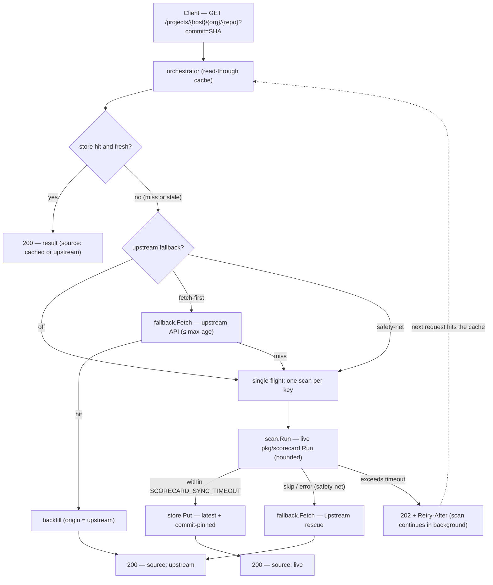
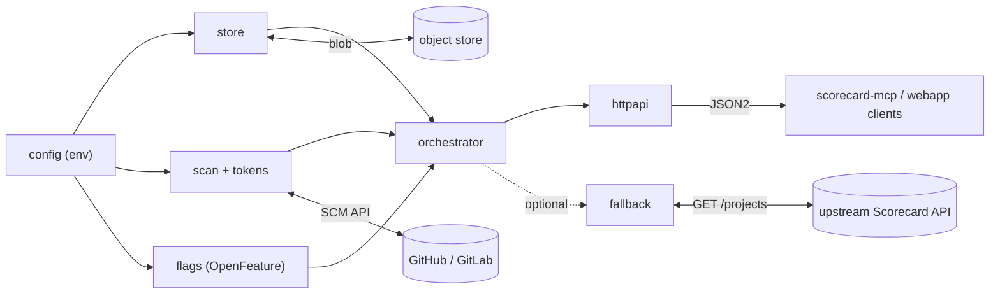

<!--
Copyright 2026 OpenSSF Scorecard Authors.
SPDX-License-Identifier: Apache-2.0
-->

# OpenSSF Scorecard Infrastructure

[](https://github.com/ossf/scorecard-infra/actions/workflows/presubmits.yml)
[](https://scorecard.dev/viewer/?uri=github.com/ossf/scorecard-infra)
[](CODE_OF_CONDUCT.md)
[](LICENSE)
[](go.mod)

The infrastructure that runs [OpenSSF Scorecard](https://github.com/ossf/scorecard)
as a service — and the work to make it run anywhere.

> **Scorecard results are heuristic signals, not a verdict.** Nothing here asserts
> that a repository "is secure" or "is insecure"; every result declares its source,
> freshness, and completeness. A score of `-1` means *inconclusive*, not failing.

## Contents

- [About The Project](#about-the-project)
- [Getting Started](#getting-started)
  - [Prerequisites](#prerequisites)
  - [Installation](#installation)
- [Usage](#usage)
  - [Batch scanning pipeline](#batch-scanning-pipeline)
  - [Results API (api.scorecard.dev)](#results-api-apiscorecarddev)
  - [Results API server](#results-api-server)
  - [Provider-agnostic migration](#provider-agnostic-migration)
- [Roadmap](#roadmap)
- [Contributing](#contributing)
- [License](#license)
- [Contact](#contact)
- [Acknowledgements](#acknowledgements)

## About The Project

`ossf/scorecard` is the **engine**: checks, probes, scoring, output formats. This
repository is what surrounds it — the batch pipeline that scans 1M+ repositories
every week, the API that serves what it produces, and the design for moving that
stack off any single cloud provider.

| | Path | Role | State |
| --- | --- | --- | --- |
| **Batch scanning pipeline** | `cron/` | **Producer** — scans 1M+ repositories weekly and writes results to object storage | Production. GCP-bound. Imported from `ossf/scorecard`; behavior-frozen. |
| **Results API** | `api/` | **Serving tier** — the service behind `api.scorecard.dev` | Production. GCP-bound. Imported from `ossf/scorecard-webapp`; behavior-frozen. **This is what ships.** |
| **Results API server** | `cmd/scorecard-api`, `internal/` | A provider-agnostic implementation of the same contract, with a read-through cache and live scanning | v0 complete. Not currently the deployment path. |
| **Provider-agnostic design** | `docs/research/` | **The plan** — a reference design for running Scorecard's hosted data services on any cloud or self-hosted target | Reference design; not yet an official artifact. |

These are one system's present and future, not four unrelated projects. The
pipeline is a *producer* writing Scorecard results to a bucket; the API is the
*consumer* reading them back out over HTTP. Both arrived here from elsewhere, so
that the whole hosted data path lives in one place — which is the precondition
for moving it, and for eventually reconciling the two implementations of the
serving tier into one.

They share a repository and **no code**. There are no import edges in any
direction, enforced by CI, and that is deliberate: both imported trees are
**behavior-frozen** until their production cutovers complete, because equivalence
with what they replaced is both the acceptance test and the rollback path.
Converging them is the point of landing them together; it has not happened yet
and should not happen incidentally (designs **C11** and **W10**, in
[`migrate-batch-pipeline`](openspec/changes/migrate-batch-pipeline/design.md) and
[`migrate-api`](openspec/changes/migrate-api/design.md)).

## Getting Started

### Prerequisites

Common to everything here:

- **Go** matching [`go.mod`](go.mod) (1.25.x). If builds fail with a Go tool
  version mismatch across many stdlib packages, a stray `GOROOT` is the cause —
  prefix commands with `env -u GOROOT`.

To run the **results API server**:

- An **object store** reachable by a `gocloud.dev/blob` URL — a local directory
  (`file://…`) is enough to start; see [Storage backends](#storage-backends).
- For **live scans only**: network egress (the engine calls the SCM API and
  Scorecard's auxiliary data sources) and an **SCM token** (`GITHUB_AUTH_TOKEN`).
  Serving already-cached results needs neither.

To build the **batch pipeline** images or regenerate its protobufs:

- **`ko`** and **`protoc`** on `PATH`. They are expected rather than vendored;
  the Makefile explains why and fails with actionable errors when they are
  missing.
- Running the pipeline itself additionally requires its GCP dependencies (PubSub,
  GCS, BigQuery) and the cluster described in [`cron/k8s/README.md`](cron/k8s/README.md).

### Installation

Clone the repository:

```sh
git clone https://github.com/ossf/scorecard-infra
cd scorecard-infra
```

Build the API server:

```sh
go build -o scorecard-api ./cmd/scorecard-api
```

Or, once a version is tagged, install the binary directly:

```sh
go install github.com/ossf/scorecard-infra/cmd/scorecard-api@latest
```

Build the pipeline binaries and images with `make build-controller`,
`make build-worker`, …, or `make dockerbuild` for all six images. Run
`make help` for the full, grouped list of targets.

## Usage

### Batch scanning pipeline

`cron/` is the batch scanning pipeline behind the weekly public Scorecard scan of
1M+ repositories. It was imported from
[`ossf/scorecard`](https://github.com/ossf/scorecard) with its full commit history
— 466 commits dating to 2020 — because the operational history *is* the runbook:
quota workarounds, shard sizing, PubSub ack deadlines, and BigQuery schema
migrations exist only as commit messages.
[`cron/initial-graft.md`](cron/initial-graft.md) records the terms of that import,
including what could not come across and where to trace it.

Read it before working in this tree. Two rules apply here and nowhere else in the
repository: the tree is behavior-frozen until cutover, and `cron/internal/format`
serializes a data model that lives upstream, so a schema edit here without the
corresponding engine change breaks the published contract silently
(`schema_gen_test.go` is what catches it).

#### Pipeline components

| Component | Path | Image |
| --- | --- | --- |
| PubSub batch controller | `cron/internal/controller/` | `scorecard-batch-controller` |
| Batch scan worker | `cron/internal/worker/` | `scorecard-batch-worker` |
| CII best-practices worker | `cron/internal/cii/` | `scorecard-cii-worker` |
| BigQuery transfer | `cron/internal/bq/` | `scorecard-bq-transfer` |
| Release webhook | `cron/internal/webhook/` | `scorecard-webhook-releasetest` |
| GitHub token-pool server | `cron/internal/githubserver/` | `scorecard-github-server` |

Deployment manifests are in `cron/k8s/`; image build configs in
`cron/cloudbuild/`. `cron/internal/format/` owns the published BigQuery and JSON
schema contract, verified against the Scorecard engine's data model by
`schema_gen_test.go`.

#### Scan inventories

The repositories scanned each week are listed in `cron/internal/data/`:

| File | Scope |
| --- | --- |
| `projects.csv` | GitHub |
| `gitlab-projects.csv` | GitLab |
| `gitlab-projects-releasetest.csv` | GitLab release testing |

To add a repository, edit the relevant file and run `make add-projects`, which
normalizes the result. CI enforces both that the inventories are valid and that
`add-projects` is a no-op against them, so a hand-edit the tooling would not
produce fails the build. See [`CONTRIBUTING.md`](CONTRIBUTING.md#adding-repositories-to-the-weekly-scan)
for the full contribution path.

> [!NOTE]
> These inventories previously lived in `ossf/scorecard`. If you followed a link
> there, this is the right place now.

#### Pipeline targets

```sh
make help                  # every target, grouped
make dockerbuild           # build all six images
make ko-images             # the same six via ko
make validate-projects     # validate the scan inventories
make build-proto           # regenerate protobufs (requires protoc on PATH)
```

`ko` and `protoc` are expected on `PATH` rather than vendored; the Makefile
explains why and fails with actionable errors when they are missing.

### Results API (api.scorecard.dev)

The service behind `api.scorecard.dev` and `api.securityscorecards.dev`,
imported from [`ossf/scorecard-webapp`](https://github.com/ossf/scorecard-webapp)
with its full history. **This is the API that ships.** It is what every live
consumer already talks to: the project website's result viewer,
`img.shields.io`, the Scorecard GitHub Action's upload path, and `scorecard-mcp`.

The website that consumed it stays in `ossf/scorecard-webapp`, which remains its
home; only the Go API moved.

| Path | Contents |
| --- | --- |
| `api/openapi.yaml` | The published contract. Also the API gateway's deployment configuration, so editing it changes a deployed service. |
| `api/app/server/` | Hand-written handlers: results retrieval, badge redirect, the signed-upload publish path, workflow verification, CDN purge. |
| `api/app/generated/` | go-swagger output derived from the contract. `configure_scorecard.go` is hand-owned despite living here. |
| `api/main.go` | Entry point. Builds as `scorecard-webapp` — see the note below. |
| `api/initial-graft.md` | What the import brought across, what it could not, and why. |

Endpoints, unchanged by the migration:

| Endpoint | Behavior |
| --- | --- |
| `GET /projects/{platform}/{org}/{repo}` | Published result; `?commit=` for a pinned one |
| `GET /projects/{platform}/{org}/{repo}/badge` | `302` to `img.shields.io` (a redirect — it renders nothing itself) |
| `POST /projects/{platform}/{org}/{repo}` | Publish a result, after verifying its Sigstore certificate, transparency-log entry, and originating workflow |

Make targets:

```sh
make api-build     # build the binary (api/scorecard-webapp)
make api-swagger   # regenerate server and client from api/openapi.yaml
make api-docker    # build the container image
```

The image is published to `ghcr.io` by `publish-api-image.yml` on an `api/v*`
tag. Deploy the digest it reports, not a tag.

Two things that look like mistakes and are not:

- **The binary is named `scorecard-webapp`** while this repository's own server
  binary is `scorecard-api` — which inverts what each one actually is. Renaming
  changes image contents, and image equivalence is the migration's cutover gate,
  so it is deferred until after cutover.
- **The tree hardcodes `gs://` bucket URLs**, which the cloud-agnostic rules
  elsewhere in this repository forbid. It is behavior-frozen until cutover
  completes; making storage configurable is a separate, planned change.

### Results API server

A cloud-agnostic, self-hosted OpenSSF Scorecard results **API server**
(`cmd/scorecard-api`). It serves pre-computed Scorecard results from any object
store and **generates them live on demand** when the cache misses — a read-through
cache over an in-process scan engine ("hybrid").

It speaks the [`ossf/scorecard-webapp`](https://github.com/ossf/scorecard-webapp)
GET contract, so it is a drop-in `--base-url` target for
[`uwu-tools/scorecard-mcp`](https://github.com/uwu-tools/scorecard-mcp) and any
client of the public `api.scorecard.dev`.

#### Why it exists

The public Scorecard API only covers repositories that opted in via
`publish_results: true`, and its production stack is wedded to Google Cloud. Teams
that want results for **private** repos, for repos **not** in the weekly public
scan, or on **non-GCP** infrastructure have no first-class option. This server
fills that gap: it serves the same contract from **any** object store and computes
results on demand.

It is also the provider-agnostic serving tier the pipeline's own migration needs —
the same reason it is structured to graft upstream rather than to persist as a
third, divergent HTTP server.

#### How it works

Every request flows through a single **read-through cache** (the orchestrator),
which decides serve-vs-scan:



- **Freshness:** commit-pinned results (`?commit=SHA`) are immutable and cached
  forever; `latest` results carry a freshness window — the TTL for locally-scanned
  results, the fallback max-age for upstream-sourced ones — and are refreshed on
  expiry.
- **De-duplication:** concurrent requests for the same key coalesce into exactly
  one scan (single-flight), so a burst of clients can't trigger redundant scans
  or exhaust SCM rate limits.
- **Upstream fallback (optional):** when enabled, a cache miss can reuse a recent
  result from an upstream Scorecard API — before scanning (`fetch-first`) or only
  when a scan can't run (`safety-net`). It is off by default and reported honestly
  (`X-Scorecard-Source: upstream`); see [Upstream result fallback](#upstream-result-fallback).
- **Persistence:** a live scan writes both the `latest` pointer and the
  commit-pinned object; a used upstream result is backfilled tagged as upstream.
  Results are immediately reusable by this server, the public webapp, and
  `scorecard-mcp`.

#### Server components

The binary wires nine focused packages: `config → store + scanner + flags →
orchestrator (+ optional fallback) → HTTP`.



The `model` package (JSON2 + provenance + repo-ref parsing) is shared across all
of these.

| Component | Path | Responsibility |
| --- | --- | --- |
| **Binary** | `cmd/scorecard-api` | Loads config, wires the store, scanner, and orchestrator, and serves the HTTP API with graceful shutdown. |
| **model** | `internal/model` | Lean mirror of Scorecard **JSON2** plus provenance and `platform/owner/repo` parsing (default `github.com`; also `gitlab.com`; 40-hex commits). |
| **store** | `internal/store` | Object storage over [`gocloud.dev/blob`](https://gocloud.dev/); backend chosen by URL; implements the `{host}/{org}/{repo}[/{commit}]/results.json` key contract. |
| **scan** | `internal/scan` | The live engine: wraps `pkg/scorecard.Run`, reuses the OSS-Fuzz/CII/vulnerability clients across scans, and formats results to JSON2. |
| **fallback** | `internal/fallback` | Optional best-effort client that fetches an existing `latest` result from an upstream Scorecard API over the `/projects` contract (bounded by a timeout and max-age). |
| **tokens** | `internal/tokens` | SCM token pool (feeds Scorecard's `GITHUB_AUTH_TOKEN` rotation), per-host rate limiter, and bounded-concurrency worker pool with backoff. |
| **orchestrator** | `internal/orchestrator` | The read-through cache: freshness/TTL policy, single-flight de-duplication, and the sync-vs-async (`200`/`202`) decision. |
| **httpapi** | `internal/httpapi` | The webapp GET contract (`/projects`, `/badge`), plus `/capabilities`, `/health`, `/readyz`, and error mapping. |
| **config** | `internal/config` | 12-factor environment configuration with fail-fast validation. |
| **flags** | `internal/flags` | Runtime feature-flag seam over OpenFeature; in-process env-seeded static provider with fail-safe defaults (gates the upstream fallback's `enabled`/`mode`). |

> **This server is not currently the deployment path.** It was built here as a
> provider-agnostic implementation of the results contract, on the assumption
> that its durable pieces would graft outward into `ossf/scorecard-webapp` and
> `ossf/scorecard`. Both of those graft targets have since been imported into
> this repository instead — see [Results API](#results-api-apiscorecarddev)
> below — so what ships is the code already serving production. This package set
> is retained and still builds; it is not where new API surface should go.
> [`docs/upstream-graft.md`](docs/upstream-graft.md) explains the reversal and
> what still genuinely grafts upstream.

#### Run the server

```sh
export SCORECARD_RESULTS_BUCKET_URL="file:///tmp/scorecard"   # required
export GITHUB_AUTH_TOKEN="ghp_..."                            # only for live scans
./scorecard-api
```

The server logs its listen address (default `:8080`) and the resolved bucket URL,
then serves until it receives `SIGINT`/`SIGTERM`.

#### Endpoints

| Method & path | Returns |
| --- | --- |
| `GET /projects/{host}/{org}/{repo}` | Latest result as canonical Scorecard **JSON2** |
| `GET /projects/{host}/{org}/{repo}?commit={sha}` | The immutable result for a 40-hex commit |
| `GET /projects/{host}/{org}/{repo}/badge` | SVG badge for the aggregate score |
| `GET /capabilities` | This server's mode, coverage, freshness policy, and caveats |
| `GET /health` | Liveness (always `200` while serving) |
| `GET /readyz` | Readiness (`503` until dependencies are usable) |

`host` includes the TLD (e.g. `github.com`). `github.com` and `gitlab.com` are
supported.

```sh
# Latest (cache HIT if present, else a live scan populates the cache)
curl -s http://localhost:8080/projects/github.com/ossf/scorecard | jq .score

# A specific, immutable commit
curl -s "http://localhost:8080/projects/github.com/ossf/scorecard?commit=<40-hex-sha>"

# Badge, capabilities, health
curl -s  http://localhost:8080/projects/github.com/ossf/scorecard/badge
curl -s  http://localhost:8080/capabilities | jq .
curl -sI http://localhost:8080/health
```

On a cache miss the server attempts a synchronous scan within
`SCORECARD_SYNC_TIMEOUT`. If it finishes in time you get `200` with the result;
otherwise you get `202 Accepted` with a `Retry-After` header while the scan
continues in the background and populates the cache for your next request.
Malformed refs return `400`, unreachable/blocked repos `404`, and scan failures
`502`.

#### Provenance headers

Result bodies are canonical JSON2, served verbatim so webapp-compatible clients
parse them unchanged. Provenance is carried in response headers instead:

| Header | Meaning |
| --- | --- |
| `X-Scorecard-Source` | `cached` or `live` |
| `X-Scorecard-Resolved-Commit` | The commit the result was computed at |
| `X-Scorecard-Generated-At` | Result generation date (RFC 3339) |
| `X-Scorecard-Version` | Scorecard engine version |
| `X-Scorecard-Complete` | Whether every check produced a conclusive score |

#### `GET /capabilities`

Exists so clients report provenance from the server instead of assuming
public-cache behavior:

```json
{
  "mode": "cached+live",
  "checks": "all",
  "requires_opt_in": false,
  "latest_ttl_seconds": 86400,
  "caveats": [
    "Scorecard results are heuristic signals, not a verdict; a repository is never labeled secure or insecure.",
    "A score of -1 is inconclusive, not a failing score.",
    "Results are generated on demand for any repository the configured token can access; no publish_results opt-in is required.",
    "Latest results are cached with a TTL and refreshed on expiry; pin a commit for an immutable result."
  ]
}
```

#### Storage backends

Results are persisted through [`gocloud.dev/blob`](https://gocloud.dev/), so the
backend is selected entirely by a URL — nothing cloud-specific is compiled in.
Credentials resolve via each backend's default chain.

| Backend | `SCORECARD_RESULTS_BUCKET_URL` example |
| --- | --- |
| Local filesystem | `file:///var/lib/scorecard` |
| S3-compatible (AWS S3, self-hosted, etc.) | `s3://my-bucket?region=us-east-1&endpoint=localhost:9000&s3ForcePathStyle=true` |
| Azure Blob | `azblob://my-container` |
| Google Cloud Storage | `gs://my-bucket` |
| In-memory (tests only) | `mem://` |

For the local filesystem backend, the bucket directory is almost always a
separate mount from the process's own temp directory — a container volume, a
bind mount, or a Kubernetes PVC. `fileblob`'s default write path (temp file in
`os.TempDir()`, then rename into place) fails with `invalid cross-device link`
in that case, so this server always opens `file://` buckets with fileblob's
[`no_tmp_dir`](https://pkg.go.dev/gocloud.dev/blob/fileblob#URLOpener) option
forced on: the temp file is written next to the destination instead. You may
briefly see a `results.json.*.tmp` file next to a result during a write.

Object keys match `scorecard-webapp` exactly, so the same objects are servable by
the public webapp and readable by `scorecard-mcp`:

```text
{host}/{org}/{repo}/results.json            # latest (mutable, TTL)
{host}/{org}/{repo}/{commit}/results.json   # pinned (immutable)
```

#### Configuration

All configuration comes from the environment. Only the bucket URL is required.

| Variable | Default | Description |
| --- | --- | --- |
| `SCORECARD_RESULTS_BUCKET_URL` | — (**required**) | `gocloud.dev/blob` URL of the result store |
| `SCORECARD_LISTEN_ADDR` | `:8080` | HTTP listen address (falls back to `:$PORT`) |
| `SCORECARD_LATEST_TTL` | `24h` | Freshness window for `latest` results |
| `SCORECARD_SYNC_TIMEOUT` | `20s` | How long a request waits before returning `202` |
| `SCORECARD_SCAN_TIMEOUT` | `5m` | Bound on a background scan |
| `SCORECARD_RETRY_AFTER` | `10s` | `Retry-After` hint on a `202` |
| `SCORECARD_SCAN_CONCURRENCY` | `4` | Max simultaneous live scans |
| `SCORECARD_ENABLED_CHECKS` | all | Comma-separated check names to restrict to |
| `SCORECARD_GITHUB_TOKENS` | — | Comma-separated SCM token pool (falls back to `GITHUB_AUTH_TOKEN`) |
| `SCORECARD_HOST_RATE_PER_SECOND` | `0` (unlimited) | Per-host scan rate limit |
| `SCORECARD_HOST_RATE_BURST` | `1` | Per-host rate burst |
| `SCORECARD_LOG_LEVEL` | `info` | `debug`, `info`, `warn`, or `error` |
| `SCORECARD_FLAGS_PROVIDER` | `static` | Feature-flag provider (in-process, env-seeded; `static` only for now) |
| `SCORECARD_FALLBACK_URL` | — (disabled) | Upstream Scorecard API base URL (e.g. `https://api.scorecard.dev`); enables the fallback |
| `SCORECARD_FALLBACK_TIMEOUT` | `5s` | Per-fetch timeout for the upstream fallback |
| `SCORECARD_FALLBACK_MAX_AGE` | `168h` (7d) | Max age of an upstream result to use or backfill |

Live scans call SCM and Scorecard's auxiliary data sources, so they need network
egress and an SCM token (`GITHUB_AUTH_TOKEN`, or `SCORECARD_GITHUB_TOKENS` which
is fed into Scorecard's token rotation). Serving already-cached results needs
neither.

#### Upstream result fallback

Optionally, the server can reuse an existing result from an upstream Scorecard API
(e.g. `api.scorecard.dev`) instead of always scanning locally. It is **off by
default**; set `SCORECARD_FALLBACK_URL` to enable it. Two orderings are selected
by the `fallback.mode` feature flag:

- **`fetch-first`** (default) — cache, then upstream, then a live scan on an
  upstream miss. Cheapest: reuse a recent upstream result and scan only when
  there is none. For a repository the operator does not own, a local scan is often
  *less* complete anyway (the token can't read branch protection and similar), so
  the upstream is frequently comparable and far cheaper.
- **`safety-net`** — cache, then a live scan, and the upstream only when a scan
  can't run (rate-limited, blocked, transient failure).

Runtime toggles are feature flags, overridable per flag via `SCORECARD_FLAG_*`:

| Flag override | Default | Description |
| --- | --- | --- |
| `SCORECARD_FLAG_FALLBACK_ENABLED` | `true` | Kill-switch (when a URL is configured) |
| `SCORECARD_FLAG_FALLBACK_MODE` | `fetch-first` | `fetch-first` or `safety-net` |

An upstream result may be up to a week old (bounded by `SCORECARD_FALLBACK_MAX_AGE`),
may omit some checks, and covers only repositories that opted in upstream via
`publish_results`. It is served and backfilled with `X-Scorecard-Source: upstream`
and its own generation date, so a client can tell it from a local scan.
Commit-pinned requests never use the upstream (it answers only `latest`), and
`/capabilities` reports mode `cached+upstream+live` with these caveats when the
fallback is enabled.

#### As a `scorecard-mcp` backend

[`scorecard-mcp`](https://github.com/uwu-tools/scorecard-mcp) is an MCP server
that reads Scorecard results. Point it at this server with `-base-url`, and its
`get_repo_score` / `get_check_result` tools resolve against your cache + live
scans instead of the public API:

```sh
scorecard-mcp -base-url http://localhost:8080
```

Configure it in an MCP host (Claude Desktop/Code, VS Code) the same way, setting
the base URL to your server. See the `scorecard-mcp` README for host wiring.

#### Verifying end to end

[`docs/acceptance.md`](docs/acceptance.md) is a reproducible runbook that drives a
real `scorecard-mcp` binary against this server and checks both a cache **HIT** on
`fileblob` and a cache **MISS** that triggers a live scan, persists, and re-serves
from cache.

#### Running locally with Docker Compose

```sh
cp .env.example .env   # set GITHUB_AUTH_TOKEN for live scans
docker compose up --build
```

This builds the image and serves on `:8080`, persisting results to `./data` on
the host (via a bind mount) so they survive `docker compose down` and are
browsable directly — see [Storage backends](#storage-backends). The container
runs as a non-root user, so `./data` must be writable by it; if Compose
doesn't create it for you, `mkdir -p data && chmod 0777 data` first.

To exercise the S3-compatible code path instead of the default local
filesystem store, layer the S3 override, which also spins up a self-hosted
S3-compatible store and creates the bucket:

```sh
docker compose -f docker-compose.yml -f docker-compose.s3.yml up --build
```

### Provider-agnostic migration

Scorecard's hosted infrastructure is being migrated to a new home. The purpose of
the work in `docs/research/` is to make that migration **provider-agnostic** —
portable across any cloud or self-hosted target rather than tied to a single
provider — with the smallest reliable footprint.

- [`docs/research/data-infra.md`](docs/research/data-infra.md) — the reconciled
  reference design: object store, serving tier, interchange format, public
  dataset, and cost transparency. Written to be proposable to the Scorecard
  **Infrastructure Working Group**; it is not an official artifact yet, and
  nothing in it is committed.
- [`docs/research/infra-seed-0.md`](docs/research/infra-seed-0.md) and
  [`infra-seed-1.md`](docs/research/infra-seed-1.md) — the two research passes it
  reconciles (component-selection breadth; correctness/protocol critique and data
  model).

This is the arc that gives the two systems above a shared destination. Getting the
pipeline out of `ossf/scorecard` is the precondition for it, not the work itself.

## Roadmap

**Batch pipeline.** The migration out of `ossf/scorecard` is underway: the import
landed with full history and the build, CI, and image targets are ported. Still
ahead — staging image builds diffed against their production equivalents,
repointing the Cloud Build triggers, a full clean scan cycle on infra-built
images, and only then removal from upstream. Tracked in
[`openspec/changes/migrate-batch-pipeline/`](openspec/changes/migrate-batch-pipeline/).

**API server.** Delivered in v0: the blob store (all drivers), the read-through
cache (single-flight + sync/async), the live scan engine, the token/rate manager,
the HTTP contract (`/projects`, `/badge`, `/capabilities`, `/health`, `/readyz`),
and acceptance against `scorecard-mcp` on `fileblob`. Planned or deferred:

- S3-compatible leg of the smoke test in CI (the store already has a gated integration
  test).
- Teach `scorecard-mcp` to read `/capabilities` so it reports this server's
  provenance instead of the hardcoded public-cache caveats.
- A `gocloud.dev/pubsub` broker for multi-node scan fan-out.
- A warm-cache scheduler and an analytics/index layer.
- Signed-upload `POST` (Sigstore) and request-level auth / multi-tenancy.
- Grafting the durable pieces upstream (see
  [`docs/upstream-graft.md`](docs/upstream-graft.md)).

**Convergence.** Putting `gocloud.dev/blob` under the pipeline and letting the
orchestrator serve batch-produced results is what landing the two together makes
possible. It needs its own spec and is deliberately deferred (**C11**).

## Contributing

Contributions are welcome. For detailed contributing guidelines — including how
to add a repository to the weekly scan, and the rules that apply to the
behavior-frozen `cron/` tree — please see [CONTRIBUTING.md](CONTRIBUTING.md).

```sh
make build     # go build ./...
make test      # go test ./... -race
make lint      # golangci-lint run ./...   (config in .golangci.yml, aligned with ossf/scorecard)
make help      # every target, grouped — including the pipeline targets
```

An S3-compatible integration test runs when `SCORECARD_TEST_S3_URL` is set (e.g. a
local self-hosted S3-compatible store), and is skipped otherwise.

This repository is developed spec-first with
[OpenSpec](https://github.com/Fission-AI/OpenSpec); see [`AGENTS.md`](AGENTS.md)
for conventions and [`openspec/`](openspec/) for the specs and change proposals.

Participation is governed by our [Code of Conduct](CODE_OF_CONDUCT.md).

## License

Distributed under the Apache-2.0 License. See [LICENSE](LICENSE) for more
information.

Data served from Scorecard is licensed under
[CDLA Permissive 2.0](https://github.com/ossf/scorecard#scorecard-rest-api).

## Contact

- **Maintainers** — [MAINTAINERS.md](MAINTAINERS.md)
- **Questions and help** — [SUPPORT.md](SUPPORT.md), or
  [open an issue](https://github.com/ossf/scorecard-infra/issues/new/choose)
- **Security vulnerabilities** — [SECURITY.md](SECURITY.md). Please do **not**
  open a public issue; escalation goes to
  [scorecard-steering@lists.openssf.org](mailto:scorecard-steering@lists.openssf.org).

Project Link:
[https://github.com/ossf/scorecard-infra](https://github.com/ossf/scorecard-infra)

## Acknowledgements

- The batch scanning pipeline was imported from
  [`ossf/scorecard`](https://github.com/ossf/scorecard) with its full commit
  history. `git blame` attributes to its original authors, not to the merge —
  see [`cron/initial-graft.md`](cron/initial-graft.md).
- The results API server mirrors the GET contract and blob layout defined by
  [`ossf/scorecard-webapp`](https://github.com/ossf/scorecard-webapp), and uses
  [`uwu-tools/scorecard-mcp`](https://github.com/uwu-tools/scorecard-mcp) as its
  reference client and acceptance test.
- This README was adapted from
  [https://github.com/bloomberg/oss-template](https://github.com/bloomberg/oss-template).
