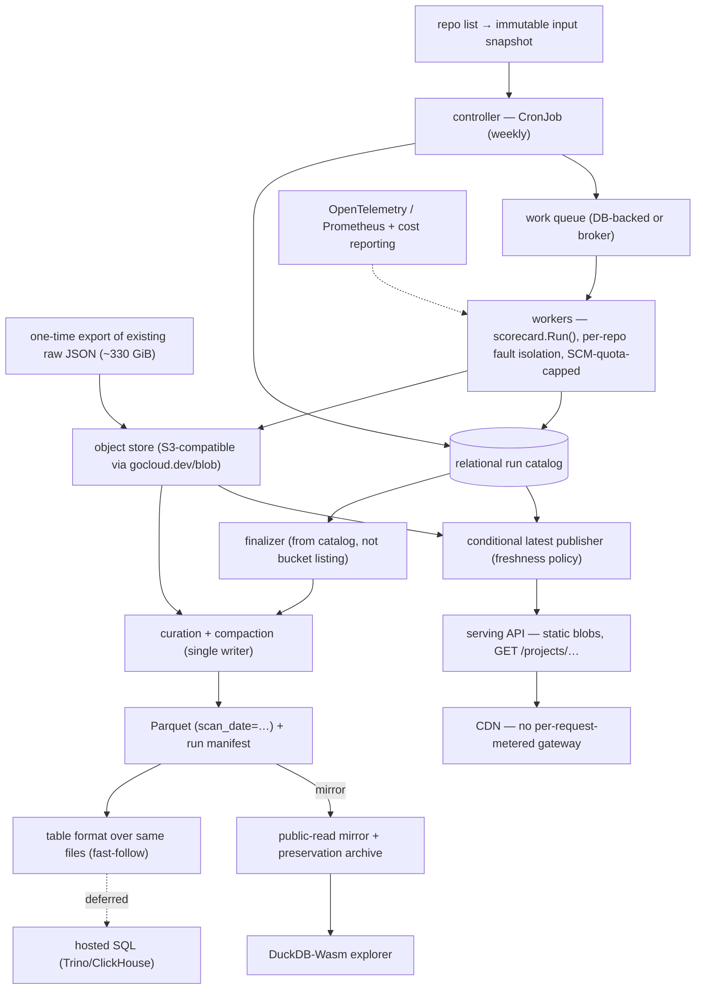

# Provider-agnostic data infrastructure for OpenSSF Scorecard

**Status: reference design, proposal-flavored. Nothing committed.** This is a
provider-agnostic design for running OpenSSF Scorecard's hosted data services.
Scorecard's hosted infrastructure is being migrated to a new home; the purpose of
this design is to make that migration **provider-agnostic** — portable across any
cloud or self-hosted target rather than tied to a single provider — with the
smallest reliable footprint. It is written to stand on its own and to be
proposable to the Scorecard **Infrastructure Working Group**; it is not an
official artifact yet.

It reconciles two research passes —
[`infra-seed-0.md`](infra-seed-0.md) (component-selection breadth) and
[`infra-seed-1.md`](infra-seed-1.md) (correctness/protocol critique + data
model) — and grounds them in the migration now underway (see
[Context](#context-a-provider-agnostic-migration)).

Prototyping note: `uwu-tools/scorecard-api` is a ground for rapidly prototyping
implementations of these components. Any component here may end up **grafted
upstream** (`ossf/scorecard`, `ossf/scorecard-webapp`), **standing alone**, or
proven here first — the design deliberately does not assume which.

## Recommendations at a glance

| Decision | Recommendation | Firmness |
| --- | --- | --- |
| Overall shape | Provider-agnostic, tool-neutral; portable roles with per-provider managed mappings | Strong |
| Migration | Greenfield + one-time raw-JSON backfill; API/DNS first, scan pipeline second; **not** dual-run | Recommendation |
| MVP | The results corpus + serving API + file-based public dataset, **built together**; hosted SQL deferred | Recommendation |
| Object store | S3-compatible via `gocloud.dev/blob`; small-file-friendly (e.g. SeaweedFS) or provider-managed; **avoid MinIO** | Strong |
| Serving | Static blobs behind a CDN — **no per-request-metered API gateway** (the current dominant cost) | Strong |
| Workflow state | None while serving-only; a relational run catalog when the scan tier is built | Recommendation (both modeled) |
| Interchange | Plain Parquet + run manifest now; a table format (Iceberg) over the same files as a fast-follow | Recommendation |
| Public dataset | Files first (Parquet + raw JSON), mirrored to a neutral distribution and preservation archive; interactive SQL later | Recommendation |
| Metrics/cost | OpenTelemetry/Prometheus + first-class cost transparency | Strong |

## Contents

- [Context: a provider-agnostic migration](#context-a-provider-agnostic-migration)
- [Goals and constraints](#goals-and-constraints)
- [The two tiers](#the-two-tiers)
- [What upstream does today](#what-upstream-does-today)
- [The problem that outranks BigQuery](#the-problem-that-outranks-bigquery)
- [MVP scope](#mvp-scope)
- [Migration and continuity](#migration-and-continuity)
- [Scaling model](#scaling-model)
- [Component decisions](#component-decisions)
- [Correctness features to adopt regardless](#correctness-features-to-adopt-regardless)
- [Recommended data model](#recommended-data-model)
- [Reference architecture](#reference-architecture)
- [Decision summary](#decision-summary)
- [Acceptance criteria](#acceptance-criteria)
- [Open questions and caveats](#open-questions-and-caveats)
- [References](#references)

## Context: a provider-agnostic migration

This is not a greenfield thought experiment. Scorecard's hosted data services are
being migrated to a new operating home, and the purpose of this design is to make
that move **provider-agnostic** — so the services are not tied to any single
cloud — with the smallest reliable footprint. Load-bearing facts that shape every
decision below:

- **Code and data governance stay with the project.** The project keeps the
  code, governance, the domains (`scorecard.dev`, `securityscorecards.dev`), and
  the **enhanced GitHub API quota token** (controlled by the project and provided
  to whoever operates the scan pipeline).
- **Operators are a small team** — the Scorecard Infrastructure group. Easy to
  change, easy to debug, easy to roll out, and **transparent cost** are hard
  requirements, met through boring, portable technology rather than any one
  operator's stack.
- **Raw JSON is the priority.** The project has accepted that the existing
  analytical warehouse (BigQuery) may not survive the move; preserving the raw
  JSON scan results (~330 GiB) is what matters.
- **Cost lesson.** The current bill is dominated by **per-request API-gateway
  metering** (~$3 per million requests at ~100 QPS, ~127M requests/month, growing
  year over year); storage and the warehouse are minor. This directly informs the
  serving design.
- **Preservation/distribution homes exist:** a neutral mirror for distribution
  and a long-term preservation archive, independent of any single provider.
- **A scan-coverage gap is acceptable** between the retirement of the current
  infrastructure and the new pipeline coming online.

What stays fixed (do not redesign): the domains and the `api.scorecard.dev`
address; **Apache-2.0 code / CDLA-Permissive-2.0 data**; the **Sigstore**
(Fulcio/Rekor) publish path; the GitHub Action and CLI; the website and CDN,
which sit outside the data pipeline and are already provider-independent of it.

The project is also evolving underneath the migration: **v6** reframes output as
a normalized **evidence/probe-findings model** (JSON/in-toto/Gemara/SARIF/OSCAL
as *views*), introduces an `evaluations` schema gated by OpenFeature during a
v5→v6 transition, and the roadmap adopts **PURL** as a key identifier. The
infrastructure must be resilient to all of that.

## Goals and constraints

1. **Parity with current traffic** is the MVP bar: the serving load (~100 QPS,
   ~127M req/month) and the weekly ~1.3M-repo scan. Optimize afterward.
2. **Provider-agnostic and tool-neutral.** Name roles and portable defaults;
   note per-provider managed mappings without committing to one.
3. **Operable by a small team.** Few, boring components; runbooks; observability;
   **cost transparency** as a first-class output.
4. **Resilient to data-model change** — the v6 evidence model and a future PURL
   key. Preserve raw evidence; treat the analytical schema as schema-on-read.
5. **Reversible**, and keep the **storage format separate from the query
   engine** so the engine never becomes a trap.
6. **Cost-aware by construction** — most immediately, do not reintroduce a
   per-request-metered API gateway.

## The two tiers

"Scorecard infrastructure" is two systems with very different portability.

| Tier | Repo | What it does | Database? | Provider lock-in |
| --- | --- | --- | --- | --- |
| **Serving** | `scorecard-webapp` | Reads `results.json` blobs, serves `GET /projects/...` | **None** — blobs only | Shallow |
| **Batch / data engineering** | `scorecard/cron` | Weekly ~1.3M-repo scan → queue → workers → object store → **BigQuery** | **BigQuery** | Deep |

The serving tier is nearly portable already (`gocloud.dev/blob`, a CDN, Sigstore
— only hard-coded bucket URLs and the current serving host are provider-specific).
The storage/data-engineering work lives in the batch tier.

## What upstream does today

**Serving (`scorecard-webapp`):** object-store blobs via `gocloud.dev/blob`
(hard-coded bucket URLs); fronted by a managed run service + an API gateway that
**meters per request** (the current dominant cost); a CDN; publish verified by
**Sigstore**. No database — results are plain `results.json` objects keyed
`{host}/{org}/{repo}[/{commit}]/results.json`.

**Batch (`scorecard/cron`):** a weekly Kubernetes CronJob shards ~1.3M repos
(10/msg, ~100–131K messages) onto a managed pub/sub queue; 14 workers scan and
write ndjson shards + per-repo blobs to the object store; twice-weekly transfer
jobs batch-load into BigQuery (date-partitioned, `WRITE_TRUNCATE`). Only two
couplings are deep: the **native pub/sub subscriber** and **BigQuery**.

## The problem that outranks BigQuery

`infra-seed-1.md`'s central finding: the pipeline uses **object names and marker
files as its authoritative workflow database**, which is a larger long-term
problem than the BigQuery dependency. A naive lift-and-shift preserves every
defect; this design fixes them.

- **Full-history bucket scans.** Finalization lists *every* key in the bucket
  each run and fails on any unparseable object — cost grows with total history
  (~5.2M objects/year), not the current run.
- **The 99% threshold freezes incomplete runs**, and **shard completion ≠
  repository completion** (a worker can skip unreachable repos and still write a
  "complete" shard); no expected/success/skip/fail totals are recorded.
- **"Latest" is an unconditional overwrite** — a delayed run can regress it.
- **Same-date reruns clobber a partition** (`WRITE_TRUNCATE`).
- **Raw and canonical share no completeness transaction.**
- **Deployment is not reproducible from Git** (manual `kubectl`, mutable tags).

The fix is a little authoritative relational state (a run catalog) plus a per-run
manifest, and GitOps + digest-pinned images.

## MVP scope

"Parity with current traffic" — and, as raised in review, **serving and the
public dataset are not independently valuable; they are two access surfaces over
one preserved corpus of results** (per-repo point lookups vs. bulk/analytical
access). So the MVP is built together:

1. **The results corpus** — raw JSON preserved immutably in the object store,
   seeded on day one from the existing ~330 GiB export (so coverage exists before
   the scan pipeline is rebuilt).
2. **The serving API** over that corpus — static blobs behind a CDN.
3. **The file-based public dataset** — Parquet + raw JSON published and mirrored
   to a neutral distribution mirror and a long-term preservation archive.

The **scan pipeline** is the *producer* that keeps the corpus fresh — harder, and
sequenced second (an accepted freshness gap, not an availability gap). The **one
genuinely separable, deferrable piece is a hosted interactive SQL endpoint** —
and the project has already deemed that (BigQuery) expendable. So: everything
together except a query server.

## Migration and continuity

**Recommendation: greenfield + one-time raw-JSON backfill; API/DNS first, scan
pipeline second; not dual-run.** This suits a small team on a fixed timeline.

- **Phase 1 — corpus + serving + dataset.** Stand up the object store; **seed it
  with the existing raw-JSON export** (this alone gives the serving API full
  coverage and the first published dataset snapshot). Redeploy the API; do a
  short shadow-read parity check; **repoint `api.scorecard.dev` DNS**.
  Best-effort one-time export of BigQuery history to Parquet as a cold archive in
  a neutral preservation home — accept it may be partial.
- **Phase 2 — scan pipeline.** Rebuild the weekly scan (queue + workers +
  finalization + curation), wired to the project-controlled GitHub quota token.
  Resume weekly scans; the corpus becomes self-refreshing.
- **Not dual-run.** The current infrastructure is being retired on a timeline; a
  prolonged parallel run isn't worth the machinery. A shadow-read parity window
  before the DNS flip is enough.

## Scaling model

The design seeds a **starter that scales** along three independent axes; don't
buy up one to solve another.

- **Capacity** — data at rest (object count, years of snapshots). Steady.
- **Throughput** — scan work/time; **bounded by the GitHub/GitLab API quota**,
  not compute, so this axis has a ceiling you scale *toward*.
- **Complexity** — features/guarantees (run catalog, table format, hosted SQL).
  Add only on a named trigger.

### Growth ladder

| Component | T0 — Starter | T1 — Small production | T2 — Growth | T3 — Scale |
| --- | --- | --- | --- | --- |
| Object store | single node / provider-managed | replicated | + lifecycle + compaction | managed or Ceph |
| Workflow state | none (manifest) | **relational run catalog** | — | HA catalog |
| Fan-out | in-process / CronJob | DB-backed queue | broker or managed queue | + autoscale |
| Workers | 1–few | small fixed pool | queue-depth autoscale | autoscale to the quota ceiling |
| Interchange | Parquet + manifest | Parquet + manifest | + table format (Iceberg) | partition evolution |
| Query | embedded (DuckDB) | embedded / in-DB | + browser (Wasm) | hosted SQL (Trino/ClickHouse) |
| Public dataset | files | files + mirrors | + Wasm explorer | + hosted SQL |
| Scheduling | CronJob | CronJob + GitOps | Helm/Kustomize, digest-pinned | workflow engine if coordination |
| Metrics/cost | logs | Prometheus/OTel + cost report | dashboards & alerts | — |

### Invariants held fixed across every tier

- The storage key / serving contract:
  `{host}/{org}/{repo}[/{commit}]/results.json`.
- **Parquet as the interchange format** — a table format layers *over* it.
- The `gocloud.dev/blob` seam — a storage change is a URL change.
- The `GET /projects/...` API contract.
- **Raw evidence preserved immutably** — so v6/PURL model changes are additive.

## Component decisions

Each is a **role** with a portable default, per-provider managed mappings, the
trigger to change, and reversibility. Tool-neutral: the operator maps roles to
their own stack.

### 1. Object storage

Everything goes through `gocloud.dev/blob` (S3/Azure/GCS/file). Non-AWS S3
endpoints need `use_path_style=true`, explicit `region=`, `endpoint=`, and
`disable_https=true` for in-cluster HTTP.

- **Portable default:** an S3-compatible store; **small-object-at-scale matters**
  (~1.3M repos × a few objects), which favors a small-file-optimized store such
  as SeaweedFS if self-hosting.
- **Managed mappings:** AWS S3, Azure Blob, Cloudflare R2 (zero egress — strong
  for the public mirror).
- **Avoid MinIO** for new self-hosted deployments (`minio/minio`/`mc` archived,
  source-only, commercial pivot).
- *Reversibility: URL change.*

### 2. Workflow state (two models)

Applies to the batch tier only.

- **Model A — object-store only:** stateless workers; completeness from object
  presence + a per-run manifest. Fewest components.
- **Model B — relational run catalog:** authoritative run/shard/repo state,
  idempotency, conditional "latest." Fixes the run-state defects fully.

**Recommendation:** **none while serving-only; a relational run catalog (Model B)
when the scan tier is built.** Phase 1 (serving from the seeded corpus) needs no
database. Model B is the clean fix for the run-state defects, the data is tiny
for any relational DB, and adopting it lets a DB-backed queue and in-DB analytics
reuse the *same* database — fewer distinct systems, not more. Tool-neutral:
"a relational database," not a specific product. *Reversibility: behind an
interface; Model A remains the minimal fallback.*

### 3. Fan-out / work distribution

The native pub/sub subscriber is the current lock-in. Requirements:
at-least-once + redelivery, long/variable ack, back-pressure; throughput is
trivial (~0.2 msg/s average). Options: a **DB-backed job queue** (no broker —
natural under Model B), a **portable broker** (RabbitMQ via `gocloud.dev/pubsub`
gives at-least-once today), a **provider-managed queue** (SQS/Service Bus, KEDA
autoscaling), or **NATS JetStream** (direct client). Caveats to record: the
gocloud **NATS driver is at-most-once**, and its **Kafka driver can't `Nack`** —
Kafka needs a bespoke consumer.

**Recommendation:** follow the workflow-state choice — a DB-backed queue under
Model B, else a portable broker. Adopt regardless: **scale by queue depth capped
by the SCM API quota** (not CPU), and a **dead-letter path**.

### 4. Interchange format

The durable contract every engine and external consumer reads; independent of
the engine.

**Recommendation: plain Hive-partitioned Parquet + a run manifest now, with a
table format (Iceberg) layered over the same files as a fast-follow.**

- Parquet (`scan_date=…/`, produced by a single curation stage — not per-worker)
  is the universal, catalog-free public contract. At weekly cadence there is no
  small-file problem.
- The **manifest** (counts, checksums, completeness, versions) already delivers
  reproducible rebuilds and honest completeness **without** a catalog.
- Layer **Iceberg over the same files** as a fast-follow — not "someday" —
  because the **v6 evidence model and PURL make schema evolution recurring**.
  Store the **full raw evidence** plus a small stable typed subset; keep the
  analytical schema **schema-on-read** so v5 and v6 shapes coexist during the
  OpenFeature-gated transition. Consumers never have to adopt Iceberg.
- Delta is ruled out (no Go writer). *Reversibility: Parquet is the constant.*

### 5. Analytics / query engine

The analytical data is tiny (~68M rows/year), so this sorts by ops, not speed.

- **Portable default:** embedded querying over Parquet (e.g. DuckDB), or in-DB
  querying if a relational catalog is present.
- **Hosted SQL (deferred):** Trino-over-Iceberg or ClickHouse only in the
  endpoint phase; schema-on-read absorbs the evolving model in all cases.
- Ruled out on licensing/shape: QuestDB (Parquet-in-object-store is
  Enterprise-only), open-core gating (Databend/GreptimeDB/Timescale), AGPL
  (Citus/Hydra), schema-on-ingest (Druid/Pinot).

### 6. Public dataset and distribution

BigQuery gave storage *and* interactive SQL. Replace it in phases:

1. **Files first:** partitioned Parquet + raw JSON + a versioned schema doc + a
   per-run manifest + date/commit-addressed snapshots, in a public-read bucket.
   Anyone queries with their own DuckDB/Polars/Spark — no account, no server.
2. **Mirrors/preservation:** publish to a **neutral distribution mirror** and a
   **long-term preservation archive**, independent of any single provider.
3. **Interactive SQL (only on demand):** a browser (DuckDB-Wasm) explorer, then
   a hosted read-only SQL endpoint if the community needs it.

### 7. Serving API + CDN

**The cost lesson made concrete:** the current dominant cost is per-request
API-gateway metering. Serve **static result blobs directly from the object store
behind a CDN** — no metered API-management layer in the hot path. Keep the
`GET /projects/...` contract and object-key scheme unchanged; preserve the
Sigstore publish path. `uwu-tools/scorecard-api` (cloud-agnostic
`gocloud.dev/blob`, speaks the GET contract, hybrid cache + on-miss live scan) is
a **candidate implementation** to prototype the serving tier — not an assumed
adoption.

### 8. Scheduling / orchestration

**Plain Kubernetes CronJob** as the timer; the fan-out is a queue problem, not a
scheduler problem (every workflow engine has a friction point at ~100K+ tasks).
Retries/partial-failure/backfill live at the queue + catalog layer. GitOps +
digest-pinned images + Helm/Kustomize fix the "not reproducible from Git" defect.
A durable workflow engine only if genuine cross-job coordination appears.

### 9. Observability, cost, and operations

**OpenTelemetry / Prometheus** metrics (the code already exports via OpenCensus).
Because cost is a first-order concern, treat **cost transparency as a first-class
output**: per-component cost reporting, a public status page, and runbooks so
operational knowledge isn't concentrated in any single person.

## Correctness features to adopt regardless

From `infra-seed-1.md`, under either workflow-state model:

- **Per-repo fault isolation** — one repo failing yields a per-repo error
  record, not a whole-shard retry.
- **Conditional "latest" writes + an explicit freshness policy** (action-vs-cron
  precedence, commit-time vs scan-time, force-push handling) — never regress
  "latest."
- **Honest completeness** — record expected/success/skip/fail; publish
  `COMPLETE_WITH_GAPS` with the exact missing set, not a silent shard threshold.
- **Reproducible rebuilds** — the curated dataset rebuilds entirely from raw
  objects + manifests.
- **One publication state for raw + canonical.**

## Recommended data model

Adopt when the scan tier is built (Model B). Object layout:

```text
input/   run_id=<uuid>/ {projects.csv, manifest.json}
raw/     scan_date=<date>/ run_id=<uuid>/ shard_id=<id>/ {results.ndjson.zst, raw.ndjson.zst, shard-manifest.json}
serving/ by-commit/<host>/<owner>/<repo>/<commit>/results.json
         latest/<host>/<owner>/<repo>/results.json
curated/ scorecard_results/ scorecard_checks/ scorecard_errors/   (Parquet, later Iceberg)
```

Raw objects are immutable; `latest/` is **generated from the authoritative
catalog**, not written by whichever worker finishes last. A relational catalog
holds `scan_runs` (status `CREATED→DISPATCHING→RUNNING→COMPLETE|
COMPLETE_WITH_GAPS|FAILED→PUBLISHED`, input digest, counts), `scan_shards`
(unique `(run_id, shard_id)` idempotency key, per-shard outcomes), and
`repository_latest` (the current pointer, updated only on a freshness win). Full
column lists in [`infra-seed-1.md`](infra-seed-1.md) §5. Curated tables partition
**by scan date, never per repository**, and **preserve the full raw evidence
JSON** alongside a small stable typed subset (score, per-check/probe results),
so the v6/PURL model shift is additive.

## Reference architecture

Neutral target under Model B (roles, not products). Model A removes the catalog
and uses a manifest-only finalizer + a portable broker.



## Decision summary

| Component | Recommendation | Notes / phase | Reversibility |
| --- | --- | --- | --- |
| Object store | S3-compatible via `gocloud.dev/blob`; small-file-friendly or managed | Avoid MinIO; R2 for public mirror | URL change |
| Serving | Static blobs + CDN; no metered gateway | Removes the current dominant cost | Config |
| Workflow state | Relational catalog when scan tier built; none while serving-only | Both modeled | Behind interface |
| Fan-out | DB-backed queue (Model B) / portable broker (Model A) | Quota-capped autoscale; DLQ | Queue seam |
| Interchange | Parquet + manifest now; Iceberg over same files fast-follow | Raw preserved; schema-on-read | Parquet is constant |
| Query | Embedded now; hosted SQL deferred | Data is tiny | Reads same Parquet |
| Public dataset | Files first + neutral mirror/archive; SQL later | BigQuery expendable | Additive tiers |
| Scheduling | CronJob + GitOps + digest-pinned | Workflow engine only if coordination | Timer only |
| Observability/cost | OTel/Prometheus + cost transparency + runbooks | Working-group commitments | Exporter swap |

## Acceptance criteria

The migration/batch tier is not done until:

- `api.scorecard.dev` serves the same payloads + cache headers from the new home
  after DNS cutover; the corpus has full coverage from the backfill on day one.
- Every expected repository ends a run with an explicit success/skip/failure;
  gaps are published explicitly; no records vanish at a threshold.
- Retries don't create duplicate analytical rows (idempotent by
  `(run_id, shard_id)`); a late run can't move "latest" backward.
- Commit-addressed results are immutable; raw + canonical share one publication
  state; the curated dataset rebuilds entirely from raw + manifests.
- The public dataset is published as files and mirrored to a neutral distribution
  mirror and a preservation archive.
- Worker scaling respects the SCM API quota; a failed curation/publish job reruns
  safely.
- Per-component cost is reported transparently.

## Open questions and caveats

- **Target provider** is not finalized — the design stays neutral until it is;
  managed mappings are noted, not committed.
- **Workflow-state model** (A vs B) — the one deliberately open decision;
  recommendation is B when the scan tier is built.
- **Freshness policy specifics** (action-vs-cron, commit-vs-scan time,
  force-push) need an explicit decision; also affects this repo's upstream-
  fallback `origin` tagging.
- **v6 dual-schema window** — the analytics layer must carry v5 and v6 shapes
  during the OpenFeature-gated rollout; **PURL** may become a key identifier.
- **GitHub quota token operations** — controlled by the project, provided to the
  operator; needs a secure handoff/rotation runbook.
- **Operator-native enrichment tooling and additional data sources** are out of
  scope for the migration MVP — post-migration roadmap only; do not couple the
  MVP to them.
- **Version/licensing to re-verify:** `apache/iceberg-go` pre-1.0 (write path
  newer); gocloud NATS at-most-once and Kafka no-`Nack`; MinIO archived; confirm
  DuckDB httpfs S3 settings per backend.

## References

Synthesized inputs: [`infra-seed-0.md`](infra-seed-0.md),
[`infra-seed-1.md`](infra-seed-1.md) (each carries its own citations);
[`../upstream-graft.md`](../upstream-graft.md).

v6 / data model (`ossf/scorecard`): `docs/ROADMAP.md`, `docs/v6/` (proposal,
plan), PR #4994 (evidence model, `evaluations` schema, OpenFeature gating).

Upstream code: `ossf/scorecard` —
`cron/{config/config.yaml,internal/{controller,worker,bq,pubsub},data/{blob,summary}.go}`;
`ossf/scorecard-webapp` — `app/server/{get_results,post_results}.go`.

Key external docs: `gocloud.dev/blob`
<https://pkg.go.dev/gocloud.dev/blob/s3blob>; `gocloud.dev/pubsub`
<https://pkg.go.dev/gocloud.dev/pubsub>; Apache Iceberg
<https://iceberg.apache.org/docs/latest/>; DuckDB
<https://duckdb.org/docs/stable/clients/go>; SeaweedFS
<https://github.com/seaweedfs/seaweedfs>; Cloudflare R2
<https://developers.cloudflare.com/r2/pricing/>.
