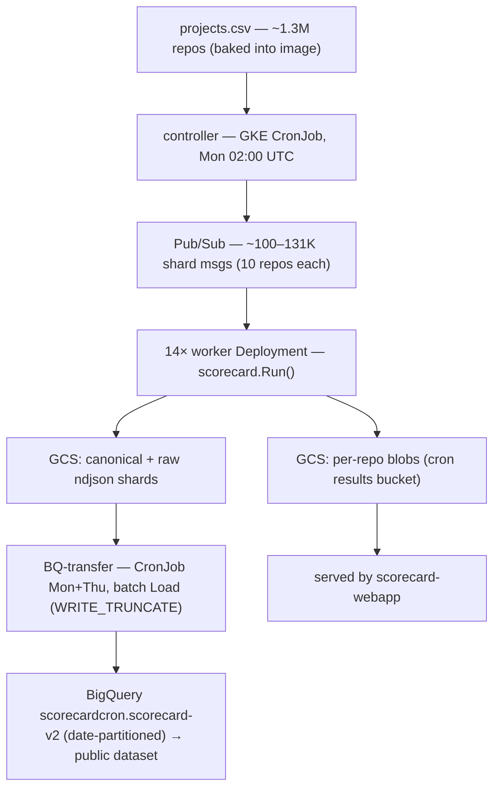
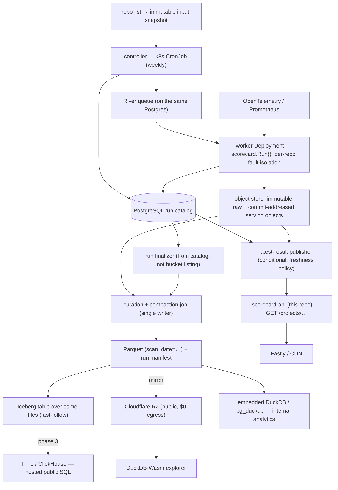

# Data engineering for a non-GCP Scorecard deployment

**Status: design-informing synthesis, nothing committed.** This document
reconciles two independent research passes into a single, component-by-component
design for running the OpenSSF Scorecard data platform off Google Cloud:

- [`research/infra-seed-0.md`](infra-seed-0.md) — a component-selection
  framework optimized for operational minimalism at the real data scale, with the
  full field per tier and a "reversible defaults" stance.
- [`research/infra-seed-1.md`](infra-seed-1.md) — a correctness/protocol
  critique of the current pipeline plus a concrete data model (a PostgreSQL run
  catalog, object layout, curated tables, run protocol, acceptance criteria).

They are complementary, not competing: seed-0 is broad on *what to pick*; seed-1
is deep on *how to make the pipeline correct*. This synthesis uses seed-0's
selection layer wearing seed-1's protocol/data-model layer.

**Scope: build here, graft upstream.** The design targets this repo
(`uwu-tools/scorecard-api`) first, structured so durable pieces can graft back
into `ossf/scorecard` and `ossf/scorecard-webapp` cleanly (see
[`upstream-graft.md`](../upstream-graft.md)). seed-1's critiques of the upstream
protocol are therefore treated as **design requirements we satisfy**, not just
commentary.

**Goal: a starter stack that scales.** This is not a "stand up the full platform
on day one" plan. It names a minimal starter stack and the explicit axes —
**complexity, capacity, throughput** — along which each component grows, with the
signal that justifies each step up. Start with the fewest moving parts that are
correct; add heft only when a named trigger fires. A small set of invariants (the
storage key contract, Parquet as the interchange, the `gocloud.dev/blob` seam,
the GET API contract) stays fixed across every tier, so growth is *additive, not
a rewrite*. See [Scaling model](#scaling-model).

Research captured 2026-08-06. Version- and licensing-sensitive claims are
flagged; re-verify before committing to build.

## Recommendations at a glance

| Decision | Recommendation | Firmness |
| --- | --- | --- |
| Object store (self-host) | SeaweedFS; **avoid MinIO** | Strong |
| Object store (public data) | Cloudflare R2 ($0 egress) | Strong |
| Workflow state | **None while serving-only; PostgreSQL as system-of-record when the batch tier is built** | Recommendation (both modeled) |
| Fan-out queue | River-on-Postgres if we adopt the catalog; RabbitMQ if a portable broker is wanted | Recommendation |
| Interchange format | Plain Hive-partitioned Parquet + run manifest **now**; Iceberg over the same files as a fast-follow | Recommendation |
| Query engine | Embedded DuckDB (or pg_duckdb if Postgres is home); hosted SQL endpoint phased in later | Recommendation |
| Public dataset | Files first (Parquet + manifest on R2), interactive SQL later | Decided (phased) |
| Scheduling | Plain Kubernetes CronJob | Strong |
| Metrics | OpenTelemetry / Prometheus | Strong |

## Contents

- [The two tiers](#the-two-tiers)
- [What upstream does today](#what-upstream-does-today)
- [The problem that outranks BigQuery](#the-problem-that-outranks-bigquery)
- [Design principles](#design-principles)
- [Scaling model](#scaling-model)
- [Component decisions](#component-decisions)
  - [1. Object storage](#1-object-storage)
  - [2. Workflow state: two models](#2-workflow-state-two-models)
  - [3. Fan-out / work distribution](#3-fan-out--work-distribution)
  - [4. Interchange format](#4-interchange-format)
  - [5. Analytics / query engine](#5-analytics--query-engine)
  - [6. The public dataset](#6-the-public-dataset)
  - [7. Serving API + CDN](#7-serving-api--cdn)
  - [8. Scheduling / orchestration](#8-scheduling--orchestration)
  - [9. Metrics](#9-metrics)
- [Correctness features to adopt regardless](#correctness-features-to-adopt-regardless)
- [Recommended data model](#recommended-data-model)
- [Reference architecture](#reference-architecture)
- [Decision summary](#decision-summary)
- [Phased delivery path](#phased-delivery-path)
- [Acceptance criteria](#acceptance-criteria)
- [Open questions and caveats](#open-questions-and-caveats)
- [References](#references)

## The two tiers

"Scorecard infrastructure" is two independent systems, with very different GCP
lock-in. Conflating them is the usual mistake.

| Tier | Upstream repo | What it does | Database? | GCP lock-in |
| --- | --- | --- | --- | --- |
| **Serving** | `scorecard-webapp` | Reads `results.json` blobs, serves `GET /projects/...` | **None** — blobs only | Shallow |
| **Batch / data engineering** | `scorecard/cron` | Weekly scan of ~1.3M repos → queue → workers → object store → **BigQuery** | **BigQuery** | Deep |

The **serving tier is already solved here**: `scorecard-api` serves the identical
GET contract from any `gocloud.dev/blob` backend and computes results live on a
miss. The storage and data-engineering work lives in the **batch tier**, which
has no first-class non-GCP story today. This document is about that tier.

## What upstream does today

**Serving (`scorecard-webapp`):** GCS blobs via `gocloud.dev/blob` (hard-coded
`gs://ossf-scorecard-results`, read-through to `gs://ossf-scorecard-cron-results`);
fronted by **Cloud Run** + **Cloud Endpoints / ESPv2**; **Fastly** CDN
(1-year surrogate TTL, purge-on-publish); publish path verified with **Sigstore**
(Rekor + Fulcio), not an API key. **No database** — results are plain
`results.json` objects keyed `{host}/{org}/{repo}[/{commit}]/results.json`.

**Batch (`scorecard/cron`):**



Scale: ~1M–1.31M repos scanned weekly, sharded 10/message (~100–131K messages),
~10K repos/hour across 14 workers; the serving side handles ~30M requests/week.
Scheduling is **Kubernetes CronJob**, not Cloud Scheduler.

**Coupling points** — only two are deep:

| Component | Today | Coupling | Notes |
| --- | --- | --- | --- |
| Object store | GCS `gs://` | **Shallow** | Already `gocloud.dev/blob`; only file + GCS drivers linked |
| Queue (publish) | `gocloud.dev/pubsub` + gcppubsub | **Shallow** | Portable API |
| Queue (consume) | **native `cloud.google.com/go/pubsub`** | **Deep** | Custom subscriber; extends ack deadline by 600s. The generic gocloud path is used only under the emulator |
| Warehouse | **BigQuery** (native client, Load jobs) | **Deep** | The other lock-in |
| Scheduling | GKE `CronJob` | Portable | Plain k8s, not Cloud Scheduler |
| Metrics | Stackdriver | Medium | OpenCensus exporter |
| CDN / site | Fastly / Netlify | Not GCP | Keep freely |

## The problem that outranks BigQuery

seed-1's most important contribution: **the current pipeline uses object names
and marker files as its authoritative workflow database, and that is a larger
long-term problem than the BigQuery dependency itself.** These are defects in the
upstream protocol; a naive lift-and-shift to non-GCP storage would preserve every
one of them. This design fixes them.

- **Full-history bucket scans.** The transfer job lists *every* key in the
  results bucket on each run (`GetBucketSummary` with an empty prefix) and fails
  if any object is unparseable. Control-plane cost grows with total history
  (~5.2M canonical shard objects/year), not with the current run.
- **The 99% threshold freezes incomplete runs.** Once 99% of shards exist, the
  run is loaded and marked transferred; late shards are excluded forever. And
  **shard completion ≠ repository completion** — a worker can skip unreachable
  repos and still write a "complete" shard, so 99% shards may hide far less than
  99% repository coverage. Run metadata records no expected/success/skip/fail
  repository totals.
- **"Latest" is an unconditional overwrite.** Both the cron worker and the action
  POST overwrite `results.json` with no monotonic/version check, so a delayed run
  finishing after a newer one can regress "latest."
- **Same-day reruns clobber a partition.** The BigQuery loader uses
  `WRITE_TRUNCATE` against a date partition; a second same-date run replaces the
  first rather than versioning it.
- **Raw and canonical have no shared completeness.** Separate buckets, jobs, and
  markers; nothing guarantees the two analytical datasets describe the same repo
  set for a run.
- **Deployment is not reproducible from Git.** Manifests are applied to GKE by
  hand; images use mutable `stable`/`latest` tags; a sidecar restarts the worker
  Deployment.

The fix for the first five is a small amount of authoritative relational state (a
run catalog) plus a manifest per run; the fix for the last is GitOps + digest-
pinned images. Both are folded into the component decisions below.

## Design principles

Merged from both seeds:

1. **Non-GCP**, self-hostable on Kubernetes or a bare VM (or embeddable in the Go
   service).
2. **Correctness of the batch pipeline is a first-class goal**, not just
   provider portability (seed-1). Every repository in a run ends with an explicit
   success / skip / failure outcome.
3. **Operational surface is a first-class cost** for a small OSS team (seed-0).
   Prefer the fewest, most boring components.
4. **Keep decisions reversible**, and **separate the storage format from the
   query engine** so the engine choice never becomes a trap.
5. **Reuse what we already have**: `gocloud.dev/blob`, SeaweedFS, the serving
   contract.

**Scale reframe (seed-0):** at ~1.3M rows/week (~68M rows/year of small JSON
blobs) the analytical data is *tiny* for every engine considered. The heavy
choices (a distributed warehouse, a big query cluster) are **not** justified by
size — they are justified only by a concrete feature need (e.g. a hosted public
SQL endpoint). This keeps the default light while leaving room to grow.

## Scaling model

The design seeds **starter infrastructure that scales**. Growth is decomposed
into three independent axes; the mistake to avoid is buying up one axis to solve
a problem on another (e.g. standing up a distributed warehouse — complexity — to
hold more history — capacity).

- **Capacity** — data at rest: object count and years of accumulated weekly
  snapshots. Grows steadily and predictably.
- **Throughput** — scan work per unit time: repos/hour, queue depth. Bounded by
  the GitHub/GitLab API quota, *not* by compute — so this axis has a hard ceiling
  you scale *toward*, not past.
- **Complexity** — features and guarantees: run catalog, Iceberg, hosted SQL,
  workflow orchestration. Grows only when a data-quality or public-query need
  appears.

### Growth ladder

Read left-to-right as demand grows. T0 is the smallest thing that is *correct*
end to end; each later tier is additive.

| Component | T0 — Starter (one box) | T1 — Small production | T2 — Growth | T3 — Scale |
| --- | --- | --- | --- | --- |
| Object store | `file://` or single SeaweedFS | SeaweedFS, replicated | + lifecycle + compaction | Ceph / managed (S3, R2) |
| Workflow state | none — manifest only (Model A) | **Postgres run catalog (Model B)** | — | HA Postgres |
| Fan-out | in-process loop / CronJob | River on Postgres | RabbitMQ or managed queue | broker + KEDA autoscale |
| Workers | 1–few, fixed | small fixed pool | queue-depth autoscale | autoscale to the SCM-quota ceiling |
| Interchange | Parquet + manifest | Parquet + manifest | **+ Iceberg over same files** | Iceberg (partition evolution) |
| Query engine | embedded DuckDB | DuckDB / pg_duckdb | + DuckDB-Wasm (public) | hosted Trino / ClickHouse |
| Public dataset | none / local files | files on R2 | files + Wasm explorer | + hosted interactive SQL |
| Scheduling | CronJob | CronJob + GitOps | + Helm/Kustomize, digest-pinned | Temporal (only if coordination) |
| Metrics | logs | Prometheus / OTel | + dashboards & alerts | — |

### Triggers to advance

- **T0 → T1:** you need durable correctness guarantees, more than one writer, or
  a public mirror → add the Postgres run catalog and replicated storage.
- **T1 → T2:** recurring check-set schema change or reproducibility needs justify
  snapshots → add Iceberg over the same Parquet; a fixed worker pool saturates →
  queue-depth autoscaling.
- **T2 → T3:** external users demand interactive SQL → hosted endpoint; object
  count or durability outgrows single-node SeaweedFS → Ceph or a managed store;
  genuine cross-job coordination emerges → Temporal.

### Invariants that never change across tiers

These are what make every step additive rather than a migration:

- The storage key / serving contract:
  `{host}/{org}/{repo}[/{commit}]/results.json`.
- **Parquet as the interchange format** — Iceberg is *layered over* it, never a
  swap; consumers of the public dataset are never forced to change engines.
- The `gocloud.dev/blob` seam — any storage change is a URL change.
- The `GET /projects/...` API contract this repo already serves.

## Component decisions

Each component gives the field, a recommendation, when a different choice wins,
and how reversible it is. The [growth ladder](#growth-ladder) above shows where
each starts and how it scales; the recommendations below are the T1 targets.

### 1. Object storage

Access is entirely through `gocloud.dev/blob`, so any S3-compatible backend is a
URL change. Non-AWS endpoints need `use_path_style=true`, an explicit `region=`
(SDK v2 signing requires a value even when the backend ignores it), `endpoint=`,
and `disable_https=true` for plain-HTTP in-cluster endpoints.

| Option | Kind | Small-object-at-scale | Ops | License / health | Public-data fit |
| --- | --- | --- | --- | --- | --- |
| **SeaweedFS** | self-host | **Best** (Haystack, O(1)) | Single binary | Apache-2.0; **bus-factor risk** | Bucket-policy public read |
| **Garage** | self-host | Good | Single Rust binary | AGPLv3 *(verify)*; no versioning/tags | Website endpoint |
| **Ceph RGW** | self-host | OK, needs tuning | **Heavy** (cluster) | Open; healthy | Mature |
| **MinIO** | self-host | Moderate | Single binary | AGPL; **repo archived, source-only, AIStor pivot** ⚠️ | Anonymous policies |
| **Cloudflare R2** | managed | n/a | Zero | proprietary | **Best — $0 egress** |
| **Backblaze B2** | managed | n/a | Zero | proprietary | Strong (free egress ≤3× stored) |
| **AWS S3 / Azure Blob** | managed | n/a | Zero | proprietary | Poor (paid egress) |

**Recommendation:** **keep SeaweedFS** for the self-hosted substrate
(small-file-at-scale is its whole reason for existing; one Apache-2.0 binary;
covers multipart, ListObjectsV2, tags, versioning, expiration lifecycle,
presigned, public-read). Manage the bus-factor risk: pin versions, keep the
`gocloud.dev/blob` seam. **Publish the public dataset to Cloudflare R2** — zero
egress is decisive. **Do not adopt MinIO** for new deployments (`minio/minio` and
`minio/mc` are archived; community builds are source-only; features are migrating
to the commercial AIStor SKU). *Reversibility: URL change.*

For AWS/Azure-native deployments, S3/Azure Blob are drop-ins via the same seam
(seed-1 Option C); note managed egress cost for public data.

### 2. Workflow state: two models

This is the hinge where the two seeds diverge, so both are modeled. It applies
only to the **batch tier**.

**Model A — object-store only (seed-0, minimal).** Stateless workers; the object
store is the substrate; completeness is inferred from object presence + a
per-run manifest. Fewest components.

**Model B — PostgreSQL as system-of-record (seed-1).** A relational run catalog
(`scan_runs`, `scan_shards`, `repository_latest`) is authoritative for run state,
per-repo outcomes, idempotency, and the "latest" pointer. See
[Recommended data model](#recommended-data-model).

| Dimension | Model A (object-store only) | Model B (Postgres SoR) |
| --- | --- | --- |
| Components | Fewest | +1 (Postgres) |
| Fixes the [run-state defects](#the-problem-that-outranks-bigquery) | Partially (manifest only) | **Fully** (idempotency, completeness, conditional latest, no full-bucket scans) |
| Idempotent retries | DIY | `INSERT ... ON CONFLICT (run_id, shard_id)` |
| Enables River (queue) + pg_duckdb (analytics) | No | **Yes — same Postgres** |
| Fit for grafting upstream | Weaker | Stronger |

**Recommendation:** **none while serving-only; PostgreSQL as system-of-record
when the batch tier is built.** This repo today *is* the serving tier and needs
no database. The moment we build the scan tier, Model B is the right call — it is
the clean fix for the run-state defects above, it is a boring well-understood
dependency, the data is tiny for it, and adopting it makes the fan-out queue
(River) and the analytics engine (pg_duckdb) fall out of the *same* Postgres, so
it **reduces** total distinct systems rather than adding them. Modeled as a
recommendation, not a commitment. *Reversibility: the catalog sits behind an
interface; Model A remains the fallback for a minimal deployment.*

### 3. Fan-out / work distribution

Both seeds independently concluded: the native GCP subscriber is the lock-in;
**RabbitMQ is the right gocloud broker; Kafka is a poor fit via gocloud because
its driver cannot `Nack`** (the worker relies on Nack/redelivery). Throughput is
a non-issue (~100–131K msgs/week ≈ 0.2 msg/s).

| Option | gocloud driver | At-least-once + redelivery | Long ack | Ops | Verdict |
| --- | --- | --- | --- | --- | --- |
| **River (Postgres, no broker)** | n/a | ✅ transactional + Rescuer | ✅ | ⭐ zero new infra *if Postgres exists* | **Default under Model B** |
| **RabbitMQ (quorum)** | ✅ `rabbitpubsub` | ✅ Ack/Nack requeue | ✅ 30-min default | Erlang broker | **Portable broker default under Model A** |
| **AWS SQS / Azure Service Bus** | ✅ `awssnssqs` / `azuresb` | ✅ visibility/lock + DLQ | ✅ | Managed | Provider-native (KEDA autoscaling) |
| **NATS JetStream** | ❌ (use client directly) | ✅ AckWait + heartbeat | ✅ | ⭐ single Go binary | Lightest broker to run |
| **Kafka / Redpanda** | ⚠️ `kafkapubsub` (no Nack) | ⚠️ offset-commit only | ⚠️ rebalance risk | JVM / single binary | Only with a bespoke consumer |

Note: "`gocloud.dev/pubsub` over NATS JetStream" does **not** exist off the shelf
— the gocloud NATS driver is core-NATS, at-most-once. JetStream needs the
`nats.go/jetstream` client directly.

**Recommendation:** follow the workflow-state choice. Under **Model B**, use
**River on Postgres** (no separate broker; transactional enqueue; Rescuer for
crash recovery). Under **Model A**, use **gocloud + RabbitMQ quorum queue** (keep
the portable abstraction; promote the emulator-only Receive path to production).
For AWS/Azure-native, SQS / Service Bus via gocloud.

Two cross-cutting requirements from seed-1, adopt regardless of broker:

- **Scale by queue depth + oldest-message age, capped by GitHub/GitLab API
  quota** — not CPU (KEDA supports this for SQS/Service Bus; River exposes queue
  depth). Blind CPU scaling just increases SCM throttling.
- **Preserve long-running-message semantics** (visibility extension / lock renew
  / unacked-with-timeout / commit-after-durable) and a **dead-letter path**.

### 4. Interchange format

The format is the durable contract every engine and every external consumer
reads. It is independent of the engine.

| Format | Engine support | Catalog | Go support | Schema evolution | Ops | Maturity |
| --- | --- | --- | --- | --- | --- | --- |
| **Plain Parquet + Hive partitioning** | Universal | **None** | Strong (`arrow-go`, `parquet-go`, `go-duckdb`) | Add-column via `union_by_name` | **Lowest** | Highest |
| **Apache Iceberg** | Broad (Trino r/w, DuckDB r/w via REST catalog, ClickHouse read) | **Yes** | `apache/iceberg-go` (pre-1.0) | First-class + partition evolution | Medium | High spec; Go/DuckDB-write newer |
| **Delta Lake** | Trino, Spark, delta-rs | Optional | **None (no Go writer)** | First-class | Medium | Ruled out for Go |
| **DuckLake** | DuckDB (full); others young | Catalog is a SQL DB | via `go-duckdb` ext | First-class | Low–Med | v1.0 Apr 2026; DuckDB-centric |

**Recommendation: plain Hive-partitioned Parquet + a run manifest now, with
Apache Iceberg layered over the same files as a fast-follow.** Reasoning:

- Plain Parquet (`scan_date=YYYY-MM-DD/`, produced by a single curation stage —
  *not* per-worker, avoiding the small-file/concurrent-writer problem seed-1
  rightly warns about) is the universal, catalog-free public contract. A handful
  of files per weekly run means no small-file problem at our cadence.
- The **run manifest** (counts, checksums, completeness, Scorecard/schema
  versions) delivers most of what seed-1 wants — reproducible rebuilds and
  honest completeness — **without** requiring Iceberg or a catalog.
- Then add an **Iceberg table over the identical Parquet files**. This is a
  fast-follow rather than "someday" because Scorecard's check-set genuinely
  evolves over time, so **schema evolution is recurring, not rare** — Iceberg's
  schema/partition evolution and snapshots earn their keep. Crucially, consumers
  never have to adopt Iceberg; plain Parquet remains the outer contract while
  Iceberg is an internal/optional convenience.

Delta is ruled out (no Go writer). DuckLake stays an *internal* acceleration
option, not the public contract, until its non-DuckDB clients mature.
*Reversibility: Iceberg reads the same Parquet; adopting or dropping it does not
change the outer contract.*

### 5. Analytics / query engine

Because the data is tiny, the field sorts by operations and licensing, not speed.

| Engine | License | Obj-store native | Go fit | Ops | Verdict here |
| --- | --- | --- | --- | --- | --- |
| **DuckDB** (embedded) | MIT | Yes (httpfs, pushdown) | Excellent (official driver) | ⭐ library | **Default** — embeds in the Go service |
| **pg_duckdb** | MIT | Yes (DuckDB in PG) | Excellent (PG driver) | Medium (PG + ext) | **If Model B (Postgres) is chosen** |
| **ClickHouse** (server) | Apache-2.0 | Yes (`s3()`) | Good; chDB embeds | Medium (Keeper if clustered) | Hosted public SQL endpoint |
| **Trino** (over Iceberg) | Apache-2.0 | Yes (catalogs) | OK (wire) | **Heavy** (JVM) | Hosted public SQL over Iceberg |
| **DataFusion** | Apache-2.0 | Yes | Weak (Rust/FFI) | ⭐ library | Only if a Rust/Arrow service |
| **Druid / Pinot** | Apache-2.0 | deep-store only | Weak | **Very heavy** | Wrong shape (schema-on-ingest) |
| QuestDB / Databend / GreptimeDB / Timescale | open-core / TSL | varies | varies | varies | Licensing/shape caveats |

**Recommendation:** default to the **"no dedicated warehouse"** path — canonical
Parquet queried on demand by **embedded DuckDB** inside the Go service. If we
adopt **Model B**, prefer **pg_duckdb** so one Postgres serves transactional
catalog state *and* S3-Parquet analytics. Defer a hosted, always-on SQL server
(**Trino over Iceberg**, or **ClickHouse**) until the public-endpoint phase
(below) — schema-on-read absorbs the evolving check set gracefully in all three.

Ruled out on licensing/shape: QuestDB (Parquet-in-object-store is Enterprise-
only), Databend/GreptimeDB/Timescale (open-core — verify per feature/version),
Citus/Hydra (AGPL), Druid/Pinot (schema-on-ingest fights check-set churn).

### 6. The public dataset

BigQuery's public dataset gave both storage *and* interactive SQL. We replace it
in phases (your call: files first, endpoint later).

1. **Files first (baseline):** partitioned Parquet + a versioned schema doc + a
   per-run manifest (counts, checksums, completeness, Scorecard version) +
   commit/date-addressed snapshots, published to **public-read R2**. Anyone
   queries with their own DuckDB / Polars / Spark / Trino — no account, no
   server. List on source.coop / Hugging Face / AWS Open Data for discovery.
2. **Cheap interactive (optional):** a **DuckDB-Wasm** browser explorer over the
   Parquet — "type SQL, get rows," no backend (single-threaded, 4 GB cap).
3. **Hosted SQL (only if demand appears):** a read-only **Trino-over-Iceberg** or
   **ClickHouse** endpoint. Add the Iceberg table (§4) to make this clean.

### 7. Serving API + CDN

**Unchanged — already solved here.** `scorecard-api` is the non-GCP serving tier:
the hybrid read-through cache serves the webapp GET contract from any
`gocloud.dev/blob` backend and scans live on a miss, for private repos, unlisted
repos, and non-GCP infra. Keep **Fastly** (or any CDN) in front. The only
upstream graft needed is parameterizing the hard-coded `gs://` buckets. The
"latest"-pointer freshness policy (§ correctness) is the one behavioral change.

### 8. Scheduling / orchestration

**Keep the plain Kubernetes CronJob** as the timer. The fan-out is a queue
problem, not a scheduler problem, and every workflow engine has a documented
friction point at ~100K+ tasks (Airflow `max_map_length` 1024; Argo ~1 MB
workflow objects; Temporal needs a search-class Visibility store to list that
many executions). Retries/partial-failure/backfill live at the queue + catalog
layer. Reach for **Temporal** only for genuine coordination-in-code (e.g. curation
depending on run finalization); a **sharded Argo** only for k8s-native DAG
observability. On a bare VM, a systemd timer or Nomad periodic (note Nomad is
BUSL-1.1). Package manifests with Helm/Kustomize, **digest-pinned images**, and
GitOps — fixing the "not reproducible from Git" defect.

### 9. Metrics

Replace the Stackdriver exporter with **OpenTelemetry / Prometheus** (the code
already exports via OpenCensus; the OTel Collector is the vendor-neutral hub).
Low effort, off the critical path.

## Correctness features to adopt regardless

These are seed-1 wins that apply under either workflow-state model and should be
built in from the start:

- **Per-repo fault isolation.** One repository failing produces a per-repo error
  record, not a Nack of the other nine in the shard. Reserve whole-message retry
  for infrastructure failures.
- **Conditional "latest" writes + an explicit freshness policy.** Never let a
  late run move "latest" backward. Decide and document: does an action result
  outrank a cron result? commit-time vs scan-time freshness? force-push / rewritten
  default branch handling? (This also touches this repo's existing
  upstream-fallback `origin` tagging.)
- **Honest completeness.** Record expected / successful / skipped / failed repo
  totals per run; publish `COMPLETE_WITH_GAPS` with the exact missing set and
  coverage percentages rather than silently freezing at a shard threshold.
- **Reproducible rebuilds.** The curated dataset must be rebuildable entirely
  from raw objects + manifests.
- **One publication state for raw + canonical**, so both analytical datasets
  describe the same repo set for a run.

## Recommended data model

Adopt seed-1's model when the batch tier is built (Model B). Object layout:

```text
input/   run_id=<uuid>/ {projects.csv, manifest.json}
raw/     scan_date=<date>/ run_id=<uuid>/ shard_id=<id>/ {results.ndjson.zst, raw.ndjson.zst, shard-manifest.json}
serving/ by-commit/<host>/<owner>/<repo>/<commit>/results.json
         latest/<host>/<owner>/<repo>/results.json
curated/ scorecard_results/ scorecard_checks/ scorecard_errors/   (Parquet, later Iceberg)
```

Raw objects are immutable; the `latest/` namespace is **generated from
authoritative catalog state**, not written by whichever worker finishes last.

PostgreSQL control tables (abbreviated — full columns in
[`research/infra-seed-1.md`](infra-seed-1.md) §5):

- **`scan_runs`** — one row per run: status
  (`CREATED → DISPATCHING → RUNNING → COMPLETE | COMPLETE_WITH_GAPS | FAILED →
  PUBLISHED`), input digest, versions, expected/success/skip/fail counts,
  published snapshot id.
- **`scan_shards`** — one row per shard; unique `(run_id, shard_id)` is the
  idempotency key; per-shard outcome counts, attempts, lease, checksums.
- **`repository_latest`** — the authoritative current pointer, updated only when
  the incoming result wins the documented freshness policy.

Curated analytical tables (Parquet, then Iceberg), partitioned **primarily by
scan date, never one partition per repository**: `scorecard_results` (one row per
repo-scan, aggregate score + `result_json`), `scorecard_checks` (one row per
repo-scan-check), `scorecard_scan_errors` (one row per failure/skip).

## Reference architecture

The recommended target under Model B (Postgres SoR). Every box is reversible via
config or a thin adapter; Model A removes Postgres and uses RabbitMQ + a
manifest-only finalizer.



## Decision summary

| Component | Recommendation | Model-both / phase notes | Reversibility |
| --- | --- | --- | --- |
| Object store | SeaweedFS; R2 for public data | Managed S3/Blob for provider-native | URL change |
| Workflow state | Postgres SoR when batch tier built; none while serving-only | **Both modeled**; recommendation not commitment | Behind an interface |
| Fan-out | River (Model B) / RabbitMQ (Model A) | SQS/Service Bus provider-native; Kafka needs bespoke consumer | Queue seam |
| Interchange | Plain Parquet + manifest now; Iceberg over same files fast-follow | Iceberg additive, not a new contract | Parquet is the constant |
| Query engine | Embedded DuckDB / pg_duckdb; hosted SQL later | Trino/ClickHouse in the endpoint phase | Reads same Parquet |
| Public dataset | Files first → Wasm → hosted SQL | **Phased (decided)** | Additive tiers |
| Serving + CDN | Unchanged (this repo) + Fastly | Only graft = parameterize `gs://` | Config |
| Scheduling | k8s CronJob; GitOps + digest-pinned images | Temporal only for coordination | Timer only |
| Metrics | OpenTelemetry / Prometheus | — | Exporter swap |

## Phased delivery path

Build-here-graft-up, merging seed-1's migration rigor with this repo's reality.

1. **Parity baseline.** Capture API samples, score distributions, key
   conventions, completion/failure rates as the regression suite.
2. **Externalize dependencies.** Parameterize all bucket URLs; link S3/Azure
   drivers; add the target queue adapter; GHCR images; OTel metrics. Run the
   existing shape on non-GCP infra against a small input set. *(Graft: the
   bucket-URL parameterization lands in `scorecard-webapp` + `scorecard/cron`.)*
3. **Introduce the run catalog (Model B).** Add Postgres; record run/shard/repo
   outcomes and per-repo error classification; move finalization off bucket
   listing. Solves the run-state defects without changing the public dataset.
4. **Curation → Parquet + manifest.** Single curation stage compacts raw shards
   into Hive-partitioned Parquet with a completeness manifest; validate counts
   and representative queries against BigQuery.
5. **Public dataset, files tier.** Publish Parquet + manifest to R2; add the
   DuckDB-Wasm explorer.
6. **Iceberg fast-follow.** Layer an Iceberg table over the same Parquet;
   validate schema-evolution and time-travel.
7. **Conditional latest + freshness policy.** Generate `latest/` from the
   catalog; enforce no-backward-regression.
8. **Hosted SQL (only on demand).** Stand up Trino-over-Iceberg or ClickHouse.
9. **Retire GCP** only after historical + current parity, rebuild-from-raw, and
   late/missing-shard behavior are all tested.

## Acceptance criteria

The batch tier is not done until (seed-1, tightened):

- Every expected repository has an explicit success / skip / failure outcome.
- No records disappear at a publication threshold; gaps are published explicitly.
- Retried messages do not create duplicate analytical rows (idempotent by
  `(run_id, shard_id)`).
- A late run cannot move a repository's "latest" backward.
- Commit-addressed results are immutable; raw + canonical share one publication
  state.
- The curated dataset rebuilds entirely from raw objects + manifests.
- Historical query results match BigQuery within documented schema/scoring diffs.
- The serving API returns the same payloads + cache headers.
- Worker scaling respects source-control API quotas.
- A failed curation/publication job can be safely rerun.

## Open questions and caveats

- **Which workflow-state model** do we commit to when we build the batch tier
  (the one decision this doc deliberately leaves open)? The recommendation is
  Model B, but confirm the Postgres dependency is acceptable.
- **Freshness policy specifics** (action-vs-cron precedence, commit-time vs
  scan-time, force-push handling) — needs an explicit decision; it also affects
  this repo's existing upstream-fallback `origin` tagging.
- **Provider target(s):** neutral self-host is the core; AWS (S3+SQS+Athena) and
  Azure (Blob+Service Bus+Databricks) are provider-native appendices that trade
  portability for lower ops — Athena/Databricks re-introduce cloud lock-in.
- **Version/licensing to re-verify:** `apache/iceberg-go` is pre-1.0 (write path
  newer); DuckDB's Iceberg write support moves between releases; DuckLake is
  < 1 year old; the gocloud NATS driver is at-most-once and the Kafka driver
  can't `Nack`; MinIO repos are archived; open-core gating for
  Databend/GreptimeDB/Timescale; confirm DuckDB httpfs S3 settings against each
  backend.

## References

Synthesized inputs: [`research/infra-seed-0.md`](infra-seed-0.md),
[`research/infra-seed-1.md`](infra-seed-1.md) (each carries its own
source citations).

Upstream (read 2026-08-06): `ossf/scorecard` —
`cron/{config/config.yaml,internal/{controller,worker,bq,pubsub},data/{blob,summary}.go}`;
`ossf/scorecard-webapp` — `app/server/{get_results,post_results}.go`, `openapi.yaml`.

Key external docs: `gocloud.dev/blob` <https://pkg.go.dev/gocloud.dev/blob/s3blob>;
`gocloud.dev/pubsub` <https://pkg.go.dev/gocloud.dev/pubsub>;
River <https://riverqueue.com/docs>;
Apache Iceberg <https://iceberg.apache.org/docs/latest/> and `apache/iceberg-go`
<https://github.com/apache/iceberg-go>;
DuckDB Go <https://duckdb.org/docs/stable/clients/go> and Hive partitioning
<https://duckdb.org/docs/current/data/partitioning/hive_partitioning.html>;
pg_duckdb <https://github.com/duckdb/pg_duckdb>;
Trino Iceberg <https://trino.io/docs/current/connector/iceberg.html>;
SeaweedFS <https://github.com/seaweedfs/seaweedfs>;
Cloudflare R2 pricing <https://developers.cloudflare.com/r2/pricing/>;
KEDA <https://keda.sh/docs/latest/scalers/aws-sqs/>;
OpenTelemetry Collector on Kubernetes
<https://opentelemetry.io/docs/platforms/kubernetes/collector/>.
