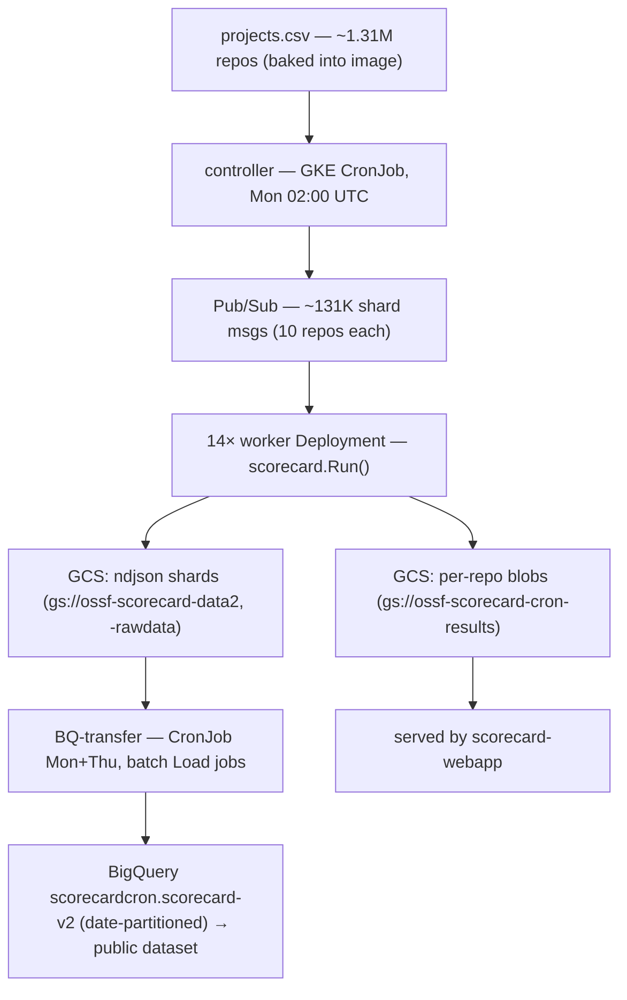
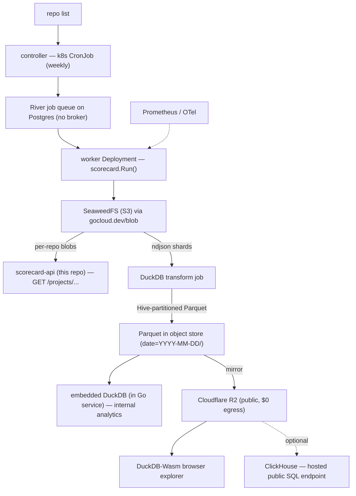

# Data engineering for a non-GCP Scorecard deployment

**Status: research + decision framework, nothing committed.** This note surveys
the storage and data-engineering options for running the OpenSSF Scorecard data
platform off Google Cloud. It exists so we choose deliberately rather than by
default, and it keeps each decision **reversible** — the components are picked so
that swapping one out later is a config change, not a rewrite. Where it lands on
a recommendation, that is a *default to start from*, not a foreclosed choice.

Research captured 2026-08-06 against `ossf/scorecard`, `ossf/scorecard-webapp`,
and the upstream project/vendor docs cited in [References](#references). Version-
and licensing-sensitive claims are flagged; re-verify before committing.

## Contents

- [The two tiers](#the-two-tiers)
- [What upstream does today](#what-upstream-does-today)
- [Design constraints](#design-constraints)
- [Tier-by-tier options](#tier-by-tier-options)
  - [1. Object storage (the substrate)](#1-object-storage-the-substrate)
  - [2. Interchange format (the pivotal decision)](#2-interchange-format-the-pivotal-decision)
  - [3. Analytics / query engine](#3-analytics--query-engine)
  - [4. The public dataset](#4-the-public-dataset)
  - [5. Fan-out / work distribution](#5-fan-out--work-distribution)
  - [6. Scheduling / orchestration](#6-scheduling--orchestration)
  - [7. Metrics](#7-metrics)
- [Reference architecture](#reference-architecture)
- [Decision summary](#decision-summary)
- [How this maps to scorecard-api](#how-this-maps-to-scorecard-api)
- [Open questions to validate](#open-questions-to-validate)
- [References](#references)

## The two tiers

"Scorecard infrastructure" is really **two independent systems**, and conflating
them is the usual mistake. They have very different amounts of GCP lock-in.

| Tier | Upstream repo | What it does | Database? | GCP lock-in |
| --- | --- | --- | --- | --- |
| **Serving** | `scorecard-webapp` | Reads `results.json` blobs, serves `GET /projects/...` | **None** — blobs only | Shallow |
| **Batch / data engineering** | `scorecard/cron` | Weekly scan of ~1.3M repos → queue → workers → object store → **BigQuery** public dataset | **BigQuery** | Deep |

The **serving tier is already solved** in this repo: `scorecard-api` serves the
identical GET contract from any `gocloud.dev/blob` backend and computes results
live on a miss. The storage and data-engineering problem lives almost entirely
in the **batch tier** — the weekly bulk scan and its warehouse — which has no
first-class non-GCP story today. This document is about that tier.

## What upstream does today

Grounded in a read of both repos (see [References](#references)).

**Serving (`scorecard-webapp`):** GCS blobs via `gocloud.dev/blob` (hard-coded
`gs://ossf-scorecard-results`, read-through to `gs://ossf-scorecard-cron-results`);
fronted by **Cloud Run** + **Cloud Endpoints / ESPv2**; **Fastly** CDN (1-year
surrogate TTL, purge-on-publish); publish path verified with **Sigstore**
(Rekor + Fulcio), not an API key. There is **no database** — results are plain
`results.json` objects keyed `{host}/{org}/{repo}[/{commit}]/results.json`.

**Batch (`scorecard/cron`):**



Scale: ~1.31M GitHub repos (+ ~20K GitLab) scanned weekly, sharded 10/message,
~10K repos/hour across 14 workers; the serving side handles ~30M requests/week.
Scheduling is **Kubernetes CronJob**, not Cloud Scheduler.

**Coupling points** — only two are deep:

| Component | Today | Coupling | Notes |
| --- | --- | --- | --- |
| Object store | GCS `gs://` | **Shallow** | Already `gocloud.dev/blob`; swap the URL |
| Queue (publish) | `gocloud.dev/pubsub` + gcppubsub | **Shallow** | Portable API |
| Queue (consume) | **native `cloud.google.com/go/pubsub`** | **Deep** | The lock-in to break |
| Warehouse | **BigQuery** (native client, Load jobs) | **Deep** | The other lock-in |
| Scheduling | GKE `CronJob` | Portable | Plain k8s, not Cloud Scheduler |
| Metrics | Stackdriver | Medium | OpenCensus exporter |
| CDN | Fastly | Not GCP | Keep or swap freely |

## Design constraints

1. **Non-GCP**, self-hostable on Kubernetes or a bare VM (or embeddable in the
   Go service).
2. **Go codebase**, small ops-light OSS team — operational surface is a
   first-class cost, not an afterthought.
3. **Avoid lock-in**; prefer OSI-licensed, multi-vendor-readable formats.
4. **Keep decisions reversible** — and in particular **separate the storage
   format from the query engine** so the engine choice never becomes a trap.
5. **Reuse what we already have**: `gocloud.dev/blob` and SeaweedFS.

**The single most important reframe:** at ~1.3M rows/week (~68M rows/year of
small JSON blobs) this is *tiny* for every engine considered. This is **not a
scale decision** — it is an operations, lock-in, and public-dataset decision.
That is why "biggest / fastest" is almost never the right answer below.

## Tier-by-tier options

Each subsection gives the field, a default to start from, and the conditions
under which a different choice wins. Nothing here forecloses a later change.

### 1. Object storage (the substrate)

Access is entirely through `gocloud.dev/blob`, so any S3-compatible backend is a
URL change. Non-AWS endpoints need `use_path_style=true`, an explicit `region=`
(SDK v2 signing requires a value even when the backend ignores it), `endpoint=`,
and `disable_https=true` for plain-HTTP in-cluster endpoints.

| Option | Kind | Small-object-at-scale | Ops | License / health | Public-dataset fit |
| --- | --- | --- | --- | --- | --- |
| **SeaweedFS** | self-host | **Best** (Haystack, O(1), ~40B/file) | Single binary | Apache-2.0; **bus-factor risk** | Bucket-policy public read |
| **Garage** | self-host | Good | Single Rust binary | AGPLv3 *(verify)*; no versioning/tags | Website endpoint |
| **Ceph RGW** | self-host | OK, needs tuning | **Heavy** (full cluster) | Open; very healthy | Mature |
| **Apache Ozone** | self-host | Billions of objects | **Heavy** (Hadoop lineage) | Apache-2.0 | S3 gateway |
| **MinIO** | self-host | Moderate | Single binary | AGPL; **repo archived, source-only, AIStor pivot** ⚠️ | Anonymous policies |
| **Cloudflare R2** | managed | n/a | Zero | proprietary | **Best — $0 egress** |
| **Backblaze B2** | managed | n/a | Zero | proprietary | Strong (free egress ≤3× stored) |
| **AWS S3 / Azure** | managed | n/a | Zero | proprietary | Poor (paid egress) |

**Default:** **keep SeaweedFS** for the self-hosted write-heavy substrate — its
whole reason for existing is small-file-at-scale, it is one Apache-2.0 binary,
and it covers the S3 surface we use (multipart, ListObjectsV2, tags, versioning,
expiration lifecycle, presigned, public-read policy). Actively manage the
bus-factor risk: pin versions and keep the `gocloud.dev/blob` abstraction so a
swap stays cheap. **Publish the public dataset to Cloudflare R2** — zero egress
is decisive for a widely-downloaded dataset. **Do not adopt MinIO** for new
deployments: `minio/minio` and `minio/mc` are archived and community builds are
source-only, with features migrating to the commercial AIStor SKU.

### 2. Interchange format (the pivotal decision)

This is more important than the engine, and independent of it: the format is the
durable contract every engine (and every external consumer of the public
dataset) reads. Get this right and the engine becomes swappable.

| Format | Engine support (read) | Catalog needed | Go support | Time-travel / schema evolution | Ops | Maturity |
| --- | --- | --- | --- | --- | --- | --- |
| **Plain Parquet + Hive partitioning** | Universal | **None** | Strong (`arrow-go`, `parquet-go`, `go-duckdb`) | Manual (old partitions) / add-column OK | **Lowest** | Highest |
| **Apache Iceberg** | Broad (DuckDB r/w via REST catalog; ClickHouse read; Trino r/w) | **Yes** | Official `apache/iceberg-go` (pre-1.0) | First-class | Medium–High | High spec; Go/DuckDB-write newer |
| **Delta Lake** | Trino, Spark, delta-rs | Optional | **None (no Go binding)** | First-class | Medium | delta-rs 1.0, not usable from Go |
| **Apache Hudi** | Spark/Flink/Trino | Optional | Very weak | First-class + upserts | **Highest** | Mature but wrong shape |
| **DuckLake** | DuckDB (full); others young | Catalog **is** a SQL DB | via `go-duckdb` ext | First-class | Low–Med | v1.0 Apr 2026; DuckDB-centric |

**Default:** **plain Parquet + Hive partitioning** (`date=YYYY-MM-DD/`, one
partition per weekly snapshot, ~128–512 MB files). Our single-writer, weekly-
append, append-only time-series pattern is the *best case* for plain Parquet and
the *worst case* for needing a table format: writing a handful of files per week
means ~52 files/year, so the "small-files problem" that motivates table-format
compaction never arises. Time-travel is implicit (old partitions are never
mutated). No catalog to run. Maximum multi-engine and public readability.

The one honest limitation is destructive schema change: Scorecard adds/removes
checks over time. Adding a check is a new column (engines reconcile via
`union_by_name`); column *renames* or *type changes* have no cross-file contract
in plain Parquet. That is the first thing a table format buys.

**Graduate to Apache Iceberg** (not Delta — no Go writer; not Hudi — wrong
shape) **when a concrete trigger fires:** row-level UPDATE/DELETE (corrections,
GDPR-style deletes) instead of rewriting partitions; multiple concurrent writers
needing ACID commits; a shift to frequent/streaming micro-batches (a real
small-files problem); destructive schema changes needing a guaranteed contract;
or consumers demanding first-class snapshot semantics. Iceberg is the graduation
target because it has a native Go client and the broadest cross-engine read
support, and its direct-metadata reads are catalog-free (keeping the public
dataset low-friction). **DuckLake** is worth watching but should stay an
*internal* query-acceleration layer over the same Parquet, not the public
contract, until its non-DuckDB clients mature.

### 3. Analytics / query engine

Because the data is tiny, the field sorts by operations and licensing, not
speed. Condensed; full field in [References](#references).

| Engine | License | Obj-store native | Go fit | Ops | Verdict here |
| --- | --- | --- | --- | --- | --- |
| **DuckDB** (embedded) | MIT | Yes (httpfs, pushdown) | Excellent (official driver) | ⭐ library | **Top pick** — embeds in the Go service |
| **ClickHouse** (server) | Apache-2.0 | Yes (`s3()`, pushdown) | Good; chDB embeds | Medium (Keeper if clustered) | **For a concurrent public SQL endpoint** |
| **pg_duckdb** | MIT | Yes (DuckDB in PG) | Excellent (PG driver) | Medium (PG + ext) | **If Postgres becomes system-of-record** |
| **DataFusion** | Apache-2.0 | Yes | Weak (Rust/FFI) | ⭐ library | Only if a Rust/Arrow service |
| **Trino / StarRocks / Doris** | Apache-2.0 | Yes (catalogs) | OK (wire protocols) | **Heavy** (JVM/cluster) | Overkill; graduation target at high concurrency |
| **Druid / Pinot** | Apache-2.0 | deep-store only | Weak | **Very heavy** (ZK + JVM) | Wrong shape (schema-on-ingest, streaming) |
| **QuestDB / Databend / GreptimeDB / Timescale** | open-core / TSL | varies | varies | varies | Licensing or shape caveats — see below |
| **"No warehouse": Parquet + embedded engine** | (engine's) | Native | Excellent | ⭐⭐ lowest | **Best fit for the stated constraints** |

**Default:** the **"no dedicated warehouse"** path — canonical Parquet in the
object store, queried on demand by **embedded DuckDB** inside the Go service
(official `go-duckdb`). No always-on cluster, no ZooKeeper/Keeper, no JVM;
"backup" is versioned Parquet objects, "upgrade" is a Go module bump. Schema-on-
read absorbs Scorecard's evolving check set gracefully.

**When DuckDB / ClickHouse is *not* the answer:**

- **Not DuckDB** when a **high-concurrency, always-on multi-tenant public SQL
  endpoint** is required — it is in-process and single-writer. Prefer
  **ClickHouse**, or publish files and let clients run their own DuckDB.
- **Neither**, when analytics must live **inside PostgreSQL** alongside
  transactional metadata → **pg_duckdb** removes a whole separate system.
- **Neither**, if the requirement ever becomes **sub-second dashboards at very
  high QPS over streaming ingest** → that is Druid/Pinot territory, at real ops
  cost. Nothing in the stated workload implies this.
- **Ruled out on licensing/shape:** QuestDB (Parquet-in-object-store is
  Enterprise-only — a hard blocker); Databend / GreptimeDB / TimescaleDB
  (open-core; the analytics features may be behind Elastic/TSL/Enterprise
  tiers — verify per feature and version); Citus / Hydra (AGPL); Druid / Pinot
  (schema-on-ingest fights the evolving check set). Delta-lake-as-engine-input
  is moot given no Go writer.

### 4. The public dataset

BigQuery public datasets let anyone query with their own billing; there is no
single GCP-free equivalent, so replace it with **open Parquet as the interchange
format** plus access tiers:

- **Tier 0 (baseline):** publish partitioned Parquet to a **public-read
  Cloudflare R2** bucket. Anyone queries directly with DuckDB / chDB /
  DataFusion / Polars / pandas — no server to run. R2's zero egress makes a
  popular dataset cost only storage. List on **source.coop / Hugging Face
  Datasets / AWS Open Data** for discoverability.
- **Tier 1 (optional):** a **DuckDB-Wasm** in-browser explorer that reads the
  Parquet client-side — a "type SQL, get rows" experience with **no backend**
  (caveats: single-threaded default, 4 GB WASM memory cap).
- **Tier 2 (only if needed):** a hosted read-only **ClickHouse** SQL endpoint
  for users who want server-side SQL with real concurrency.

### 5. Fan-out / work distribution

**Correction to an easy assumption:** "`gocloud.dev/pubsub` over NATS
JetStream" does **not** exist off the shelf. The gocloud NATS driver is
**core-NATS, at-most-once** (it explicitly tells callers not to Ack/Nack), so it
fails the at-least-once + redelivery requirement. JetStream is only reachable via
the `nats.go/jetstream` client **directly**. The gocloud drivers that ship in
`v0.46.0` *and* give at-least-once are `rabbitpubsub` and (with a semantic
mismatch) `kafkapubsub`. Throughput is a non-issue: 131K/week ≈ 0.22 msg/s.

| Option | gocloud driver | At-least-once + redelivery | Long ack (mins) | Ops | Verdict |
| --- | --- | --- | --- | --- | --- |
| **River (Postgres, no broker)** | n/a (bypasses pubsub) | ✅ transactional + Rescuer | ✅ configurable | ⭐ zero new infra if PG exists | **Default** |
| **RabbitMQ (quorum)** | ✅ `rabbitpubsub` | ✅ Ack/Nack requeue | ✅ 30-min default | Erlang broker | **Minimalist *portable* broker** |
| **NATS JetStream** | ❌ (use client directly) | ✅ AckWait + heartbeat | ✅ | ⭐ single Go binary | Lightest broker to *run* |
| **Kafka / Redpanda** | ⚠️ `kafkapubsub` (no Nack) | ⚠️ offset-commit only | ⚠️ rebalance risk | JVM / single binary | Wrong shape for variable long tasks |
| **Pulsar / Redis Streams / NSQ** | ❌ none | ✅ (DIY for some) | varies | varies | No released driver; DIY glue |
| **AWS SQS** | ✅ `awssnssqs` | ✅ visibility timeout + DLQ | ✅ ≤12h | Zero (managed) | Re-introduces cloud lock-in |

**Default:** **River on Postgres — no broker.** It removes the native-GCP
subscribe lock-in entirely rather than swapping one broker for another; it is
Go-native (MPL-2.0), gives transactional enqueue (a job exists only if its DB
transaction commits), has a Rescuer for crash recovery, and benchmarks
~46K jobs/s — orders of magnitude over need. We use none of a broker's
differentiators (no ordering, no exactly-once, no replay), and our writes are
idempotent, so at-least-once double-runs are harmless.

**If keeping the `gocloud.dev/pubsub` abstraction is a hard requirement:** use
**gocloud + RabbitMQ quorum queue** (smallest code delta — promote the existing
emulator-only gocloud Receive path to production; at-least-once and the 30-min
consumer timeout work today). Use **NATS JetStream directly** when you would
rather run the lightest broker than keep one portable abstraction.

### 6. Scheduling / orchestration

**Keep the plain Kubernetes CronJob** as the timer. The 131K-shard fan-out is a
queue problem, not a scheduler problem, and every workflow engine has a
documented friction point at that cardinality (Airflow's `max_map_length`
defaults to 1024; Argo Workflow objects are bounded ~1 MB and need node-status
offload; Temporal needs an Elasticsearch-class Visibility store to list 131K
executions). Retries, partial-failure, and backfill are all satisfiable at the
queue/worker layer (redelivery/DLQ; re-enqueue a shard range) with no new infra.

Reach for **Temporal** (Go-native durable execution) only when the problem
becomes coordination-in-code — e.g. the roll-up depending on scan completion, or
programmatic partial re-drive — and accept the cluster + DB + search ops. Reach
for a **sharded Argo** (parent → bounded child workflows) only if you want
k8s-native DAG observability. On a bare VM instead of k8s, a systemd timer or
Nomad periodic is the equivalent (note Nomad is BUSL-1.1, not OSI).

### 7. Metrics

Replace the Stackdriver exporter with a **Prometheus / OpenTelemetry** exporter.
Low effort (the code already exports via OpenCensus). Not on the critical path.

## Reference architecture

A concrete non-GCP default assembled from the per-tier picks. Every box is
reversible via config or a thin adapter.



The transform is a single DuckDB job, no server required — for example:

```sql
COPY (
  SELECT
    json_extract_string(j, '$.repo.name')   AS repo,
    json_extract_string(j, '$.repo.commit') AS commit,
    (j->>'$.date')::DATE                     AS scan_date,
    (j->>'$.score')::DOUBLE                  AS score,
    j->'$.checks'                            AS checks,  -- nested, for per-check drill-down
    j                                        AS raw      -- full JSON2 blob
  FROM read_json('s3://scorecard-data/2026.08.06/*/shard-*', format='newline_delimited')
) TO 's3://scorecard-parquet/' (FORMAT parquet, PARTITION_BY (scan_date), OVERWRITE_OR_IGNORE);
```

## Decision summary

| Component | Default to start from | Switch when… | Reversibility |
| --- | --- | --- | --- |
| Object store | SeaweedFS (self-host) | need managed / zero-ops | `gocloud.dev/blob` URL change |
| Public-data store | Cloudflare R2 ($0 egress) | egress ceases to matter | mirror target only |
| Interchange format | Plain Hive-partitioned Parquet | row-level edits, multi-writer, streaming, destructive schema change → **Iceberg** | Parquet reads under Iceberg too |
| Query engine | Embedded DuckDB (no warehouse) | concurrent public SQL → **ClickHouse**; PG is home → **pg_duckdb** | engine reads the same Parquet |
| Public dataset | Parquet on R2 + DuckDB-Wasm | users need hosted SQL → ClickHouse endpoint | additive tiers |
| Fan-out | River on Postgres (no broker) | must keep gocloud abstraction → RabbitMQ; want lightest broker → NATS JetStream | queue seam behind an interface |
| Scheduling | k8s CronJob | need coordination-in-code → Temporal | timer only |
| Metrics | Prometheus / OTel | — | exporter swap |

## How this maps to scorecard-api

- **Serving + on-demand scan is done.** The hybrid read-through cache already
  covers the non-GCP serving tier for private repos, unlisted repos, and non-GCP
  infra. This document does not change the serving path.
- **It fills two explicitly deferred roadmap items** with a concrete design: the
  "`gocloud.dev/pubsub` broker for multi-node scan fan-out" (now: River on
  Postgres by default; RabbitMQ/NATS if a broker is wanted) and the
  "analytics/index layer" (now: Parquet + embedded DuckDB, ClickHouse optional).
- **Grafting stays clean.** The batch tier is a separate concern from the
  graftable serving core, consistent with `docs/upstream-graft.md` (which
  already isolates BigQuery to `scorecard/cron`). A non-GCP batch tier is a
  companion, not a change to the thin serving path — and remains a v0 non-goal
  for this repo until we decide to build it.

## Open questions to validate

Before committing to any of the above, re-verify these version- and licensing-
sensitive points (all flagged by the research):

- `apache/iceberg-go` is **pre-1.0** with a newer write path; DuckDB's Iceberg
  **write** support (via REST catalog) updates between releases.
- **DuckLake** is < 1 year old (v1.0 Apr 2026) with immature non-DuckDB clients.
- The gocloud **NATS driver is at-most-once**; JetStream needs the direct
  client. Confirm `rabbitpubsub`/`kafkapubsub` semantics against the pinned
  `gocloud.dev v0.46.0`.
- **MinIO** repos are archived / source-only (AIStor pivot) — avoid for new
  self-hosted deployments.
- **Wasabi** 90-day minimum retention conflicts with weekly snapshot churn
  (verify current terms); **Garage** license (AGPLv3) and lack of
  versioning/object-tags.
- Open-core feature gating for Databend (Elastic-2.0), GreptimeDB (Enterprise),
  TimescaleDB (TSL) — confirm the needed features are in the free tier.
- Confirm DuckDB httpfs S3 settings (`s3_endpoint`, `s3_url_style`) and the
  `gocloud.dev/blob` path-style/region handling against each candidate backend.
- Whether a **Postgres** dependency (for River and/or pg_duckdb) is acceptable —
  if so, it consolidates the fan-out and analytics stories onto one component.

## References

Upstream (read 2026-08-06):

- `ossf/scorecard` — `cron/config/config.yaml`, `cron/internal/{controller,worker,bq,pubsub}`, `cron/data/blob.go`, `docs/design/{scalable_scorecard,cdn}.md`.
- `ossf/scorecard-webapp` — `app/server/{get_results,post_results,verify_workflow}.go`, `openapi.yaml`, `docs/dns.md`.

Object storage: SeaweedFS <https://github.com/seaweedfs/seaweedfs> and its
[S3 API wiki](https://github.com/seaweedfs/seaweedfs/wiki/Amazon-S3-API);
Garage <https://garagehq.deuxfleurs.fr/documentation/reference-manual/s3-compatibility/>;
Ceph RGW <https://docs.ceph.com/en/latest/radosgw/s3/>;
MinIO (archived) <https://github.com/minio/minio>;
Cloudflare R2 pricing <https://developers.cloudflare.com/r2/pricing/>;
Backblaze B2 pricing <https://www.backblaze.com/cloud-storage/pricing>;
`gocloud.dev/blob/s3blob` <https://pkg.go.dev/gocloud.dev/blob/s3blob>.

Formats: DuckDB Hive partitioning
<https://duckdb.org/docs/current/data/partitioning/hive_partitioning.html>;
DuckDB Iceberg <https://duckdb.org/docs/current/core_extensions/iceberg/overview.html>;
`apache/iceberg-go` <https://github.com/apache/iceberg-go>;
delta-rs <https://delta-io.github.io/delta-rs/>;
DuckLake <https://ducklake.select/docs/stable/>.

Engines: DuckDB <https://duckdb.org/docs/stable/clients/go>;
ClickHouse `s3()` <https://clickhouse.com/docs/sql-reference/table-functions/s3>
and Go <https://clickhouse.com/docs/integrations/go>;
chDB <https://clickhouse.com/docs/chdb>;
DataFusion <https://datafusion.apache.org/user-guide/introduction.html>;
Trino Iceberg <https://trino.io/docs/current/connector/iceberg.html>;
pg_duckdb <https://github.com/duckdb/pg_duckdb>;
DuckDB-Wasm <https://duckdb.org/docs/stable/clients/wasm/overview>.

Fan-out / orchestration: `gocloud.dev/pubsub` drivers
<https://pkg.go.dev/gocloud.dev/pubsub> (NATS at-most-once
<https://pkg.go.dev/gocloud.dev/pubsub/natspubsub>, RabbitMQ
<https://pkg.go.dev/gocloud.dev/pubsub/rabbitpubsub>);
NATS JetStream <https://docs.nats.io/nats-concepts/jetstream/consumers>;
River <https://riverqueue.com/docs>;
Postgres `SKIP LOCKED` <https://www.postgresql.org/docs/current/sql-select.html>;
k8s CronJob <https://kubernetes.io/docs/concepts/workloads/controllers/cron-jobs/>;
Temporal <https://docs.temporal.io/temporal>;
Argo Workflows <https://argo-workflows.readthedocs.io/en/latest/>.
