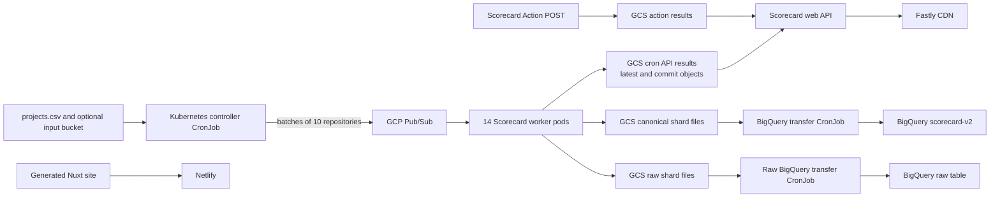
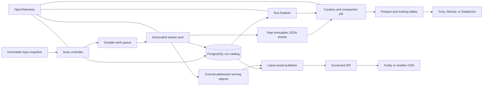

# OpenSSF Scorecard infrastructure assessment

**Research snapshot:** August 6, 2026. This is a source-code and repository-manifest assessment of the current `main` branches. It does not independently verify the resources actually running inside OpenSSF’s cloud accounts.

## Bottom line

I would **not** replace BigQuery one-for-one while preserving the rest of the current pipeline.

The stronger non-GCP design is:

- Kubernetes for the controller, workers, API, and finalization jobs.
- S3, Azure Blob, or tested S3-compatible object storage as the durable system of record.
- SQS, Azure Service Bus, or RabbitMQ for worker dispatch.
- PostgreSQL for authoritative run, shard, error, and “latest result” state.
- Compressed JSON for immutable raw data.
- Parquet plus Apache Iceberg for historical analytics.
- Trino, Athena, or Azure Databricks as the query layer.
- Object storage plus a CDN for the public API payloads.
- OpenTelemetry and Prometheus-compatible monitoring instead of Stackdriver.

The most important change is to stop using object names and marker files as the authoritative workflow database. BigQuery is the most obvious GCP dependency, but the current run-state protocol is the larger long-term data-engineering problem.

---

## 1. Repository-declared architecture today

OpenSSF says it runs a weekly scan of approximately one million critical open-source projects and publishes the historical results in `openssf:scorecardcron.scorecard-v2`, with a latest-results view in BigQuery. The REST API serves precomputed results and uses Fastly caching. ([scorecard repository](https://github.com/ossf/scorecard))



### Batch control plane

The repository config uses:

- A GCP Pub/Sub topic and subscription.
- A shard size of 10 repositories.
- A 99% shard-completion threshold.
- Stackdriver metrics.
- Separate GCS buckets for canonical shards, raw shards, API-serving results, inputs, and CII data.
- BigQuery tables for canonical and raw results. ([config.yaml](https://raw.githubusercontent.com/ossf/scorecard/refs/heads/main/cron/config/config.yaml))

The controller is a Kubernetes CronJob scheduled for Monday at 02:00 UTC. It publishes one message per shard, then writes `.shard_metadata` containing the expected shard count, shard location, and controller commit. With one million repositories and ten repositories per message, a full run is on the order of **100,000 queue messages**. ([controller.yaml](https://github.com/ossf/scorecard/raw/refs/heads/main/cron/k8s/controller.yaml))

The worker is declared as a fixed 14-replica Kubernetes Deployment. Each worker pulls one message, processes the repositories in that message sequentially, and acknowledges the message only after the shard result is durable. Errors cause the entire message to be negatively acknowledged and retried. ([worker.yaml](https://raw.githubusercontent.com/ossf/scorecard/refs/heads/main/cron/k8s/worker.yaml))

### Worker storage behavior

For each successfully scanned repository, the worker writes four API-serving objects into the cron results bucket:

```text
<platform>/<owner>/<repository>/results.json
<platform>/<owner>/<repository>/<commit>/results.json
<platform>/<owner>/<repository>/raw.json
<platform>/<owner>/<repository>/<commit>/raw.json
```

The unqualified objects represent “latest”; the commit-addressed objects are historical. The worker purges the corresponding Fastly paths after writing them. At the end of a shard, it writes the raw aggregate shard first and the canonical aggregate shard last. The canonical shard’s existence is treated as proof that the message finished. ([worker implementation](https://github.com/ossf/scorecard/raw/refs/heads/main/cron/internal/worker/main.go))

The object abstraction uses `gocloud.dev/blob`, but the Scorecard binary currently links only the filesystem and GCS drivers. Run prefixes take the form `YYYY.MM.DD/HHMMSS/`, followed by names such as `shard-0000001`, `.shard_metadata`, and `.transfer_status`. ([blob.go](https://github.com/ossf/scorecard/raw/refs/heads/main/cron/data/blob.go))

### Warehouse transfer

The transfer job:

1. Lists every object in the canonical bucket.
2. Parses all keys into timestamped runs.
3. Counts `shard-*` objects.
4. Reads `.shard_metadata`.
5. Checks for `.transfer_status`.
6. Loads any untransferred run over the 99% threshold into BigQuery.
7. Writes `.transfer_status` after the load.

The load reads a GCS `shard-*` glob and uses `WRITE_TRUNCATE` against the BigQuery date partition. Separate canonical and raw transfer CronJobs run Monday and Thursday. ([summary.go](https://github.com/ossf/scorecard/raw/refs/heads/main/cron/data/summary.go))

### Web application and API

The static site is generated by Nuxt and deployed through Netlify. The API is a Go container listening on port 8080. Repository documentation describes deploying it through Google Cloud Endpoints ESPv2 and Cloud Run, although the documented process still contains manual steps, and the visible GitHub Actions workflow is a build-and-test workflow rather than a complete deployment pipeline. ([netlify.toml](https://raw.githubusercontent.com/ossf/scorecard-webapp/refs/heads/main/netlify.toml))

For reads, the API first looks in the Scorecard Action results bucket and falls back to the cron results bucket. Both GCS bucket names are hardcoded in source. For action-published results, the POST endpoint verifies the supplied Sigstore/Fulcio/Rekor evidence and then writes both the latest and commit-addressed result objects. ([get_results.go](https://raw.githubusercontent.com/ossf/scorecard-webapp/refs/heads/main/app/server/get_results.go))

---

## 2. What is already portable

Several parts are reusable outside GCP:

| Area | Portability assessment |
|---|---|
| Worker and controller execution | Already containerized and represented as Kubernetes workloads. |
| Object-store calls | Mostly behind `gocloud.dev/blob`; additional drivers can be linked. |
| Publishing messages | Uses `gocloud.dev/pubsub.OpenTopic`, although only the GCP driver is linked today. |
| API implementation | Stateless Go HTTP service packaged as a container. |
| Frontend | Already outside GCP on Netlify. |
| CDN | Already outside GCP on Fastly. |
| Provenance verification | Sigstore/Fulcio/Rekor dependencies are independent of GCP. |
| API contract | OpenAPI-based and not tied to a cloud provider. |

Go Cloud currently provides drivers for AWS S3 and Azure Blob. It also provides queue implementations for AWS SNS/SQS, Azure Service Bus, and RabbitMQ. ([Go Cloud S3 driver](https://pkg.go.dev/gocloud.dev/blob/s3blob))

There is one significant caveat: although the publisher is close to provider-neutral, the production subscriber deliberately bypasses Go Cloud and calls the GCP Pub/Sub API directly. That custom subscriber pulls one message and repeatedly extends its acknowledgement deadline by 600 seconds. The generic Go Cloud subscriber is used only when the Pub/Sub emulator is configured. ([publisher.go](https://raw.githubusercontent.com/ossf/scorecard/refs/heads/main/cron/internal/pubsub/publisher.go))

---

## 3. Storage and data-engineering findings

### 3.1 Full historical bucket scans will become increasingly expensive

`GetBucketSummary` calls `GetBlobKeys` with an empty prefix, which lists every key in the bucket every time a transfer runs. It then parses every object. An unrecognized object causes the whole operation to fail. ([blob.go](https://github.com/ossf/scorecard/raw/refs/heads/main/cron/data/blob.go))

At the declared scale:

- Approximately 100,000 canonical shard objects are produced per weekly run.
- That is roughly 5.2 million canonical shard objects per year.
- The raw bucket receives another similar population.
- Both transfer jobs run twice weekly and repeatedly rediscover old completed runs.

The existing approach works as a simple object protocol, but its control-plane cost grows with total history rather than the size of the current run.

### 3.2 The 99% completion threshold permanently freezes incomplete runs

Once 99% of expected shards exist, the transfer loads those shards and writes `.transfer_status`. Future transfer jobs skip that run, even if additional late shards subsequently arrive. ([config.yaml](https://raw.githubusercontent.com/ossf/scorecard/refs/heads/main/cron/config/config.yaml))

At one million repositories and ten repositories per shard, the threshold could permit approximately 1,000 missing shards—nominally around 10,000 repository assignments—before publication. More importantly, shard completion is not the same as repository completion.

A worker may skip unreachable repositories and still successfully write its shard. Consequently, a 99% shard count does not establish 99% repository coverage. The run metadata does not currently record expected, successful, skipped, and failed repository totals. ([worker implementation](https://github.com/ossf/scorecard/raw/refs/heads/main/cron/internal/worker/main.go))

### 3.3 The current layout creates a small-file problem

Ten repositories per aggregate shard yields around 100,000 JSON shard files per full scan. BigQuery can bulk-load a wildcard over those files, but most non-GCP query engines will perform better when those objects are compacted into larger Parquet data files.

The workers should not each become direct Iceberg writers. That would replace the current small JSON files with many small Parquet files and introduce concurrent catalog commits. A separate curation and compaction stage is the cleaner design.

### 3.4 “Latest” objects are unconditional overwrites

Both the cron worker and action POST endpoint overwrite an unqualified `results.json` object without a monotonic version check. Commit-addressed objects are naturally immutable, but “latest” can potentially regress if an older run or delayed workflow finishes after a newer one. That appears possible from the source unless storage-generation checks or external controls not represented in the repositories prevent it. ([worker implementation](https://github.com/ossf/scorecard/raw/refs/heads/main/cron/internal/worker/main.go))

The API also has implicit source precedence: any object in the action-results bucket wins over the cron-results bucket because reads always try that bucket first. This is simple, but it is not an explicit freshness policy. ([get_results.go](https://raw.githubusercontent.com/ossf/scorecard-webapp/refs/heads/main/app/server/get_results.go))

### 3.5 Same-day reruns can overwrite each other analytically

The BigQuery loader targets a date partition and uses `WRITE_TRUNCATE`. A second completed run on the same calendar date would replace the first run’s date partition rather than append a separate run version. ([transfer.go](https://github.com/ossf/scorecard/raw/refs/heads/main/cron/internal/bq/transfer.go))

### 3.6 Raw and canonical publication are separate

The raw and canonical data have separate buckets, transfer jobs, and transfer markers. There is no single transaction establishing that the raw and canonical analytical datasets represent the same set of repositories for a run.

### 3.7 Deployment state is not reproducible from Git alone

The Kubernetes README explicitly says that manifest changes are manually applied to the GKE cluster. The controller also includes a sidecar with permission to restart the worker Deployment. Images use mutable `stable` and `latest` tags for major components. ([Kubernetes deployment directory](https://github.com/ossf/scorecard/tree/main/cron/k8s))

---

## 4. Non-GCP solution options

### Option A — Minimal-change provider migration

This preserves most of the existing model:

- Keep Kubernetes controller and worker processes.
- Keep the ten-repository message format.
- Keep raw JSON shards and per-repository API JSON.
- Replace GCS with S3 or Azure Blob.
- Replace GCP Pub/Sub with SQS, Azure Service Bus, or RabbitMQ.
- Replace the BigQuery transfer with a target-specific loader.
- Retain Fastly and Netlify.

#### Advantages

- Lowest code churn.
- Existing API paths and payloads remain unchanged.
- Existing replay and troubleshooting habits mostly survive.
- Provides the quickest route off GCP.

#### Disadvantages

- Retains marker files as workflow state.
- Retains full-bucket scans.
- Retains the 99% finalization problem.
- Requires a bespoke warehouse loader for each target.
- Does not solve small-file growth.

This is acceptable as a transition state, but it is not the architecture I would stop at.

---

### Option B — Portable object-store lakehouse

This is my recommendation.



#### Core responsibilities

| Component | Responsibility |
|---|---|
| Object storage | Durable raw payloads, input snapshots, commit-specific API objects, Parquet files, and manifests. |
| PostgreSQL | Runs, shards, repository outcomes, retry state, publication state, and current result pointers. |
| Work queue | At-least-once delivery and worker backpressure. |
| Workers | Calculate Scorecard results and durably write immutable output. |
| Finalizer | Determine complete, complete-with-gaps, or failed status using database state. |
| Curator | Validate, normalize, compact, and commit an analytical snapshot. |
| Iceberg catalog | Track table schemas, files, partitions, and snapshots. |
| Query engine | Historical and aggregate SQL access. |
| API and CDN | Low-latency serving of current and commit-specific JSON. |

Apache Iceberg is an open table format supported by engines including Spark and Trino. It provides schema and partition evolution and maintains table state through metadata and snapshots rather than reconstructing it by listing all data files. Trino’s Iceberg connector supports S3, Azure Storage, GCS, HDFS, S3-compatible storage, and several catalog choices, including JDBC and REST catalogs. ([Apache Iceberg documentation](https://iceberg.apache.org/docs/latest/))

AWS Athena can read, write, time-travel, and manage Iceberg tables on S3. Azure Databricks supports managed and foreign Iceberg tables and exposes an Iceberg REST catalog for clients such as Trino, Spark, and Flink. ([AWS Athena Iceberg documentation](https://docs.aws.amazon.com/athena/latest/ug/querying-iceberg.html))

---

### Option C — Provider-native non-GCP architecture

This gives up some portability in exchange for lower operational overhead.

| Capability | AWS | Azure | Private or hybrid |
|---|---|---|---|
| Compute | Existing Kubernetes or EKS | Existing Kubernetes or AKS | Kubernetes |
| Object storage | S3 | Azure Blob | Tested S3-compatible store |
| Queue | SQS | Service Bus | RabbitMQ |
| Run catalog | RDS PostgreSQL | Azure Database for PostgreSQL | PostgreSQL |
| Analytics | Athena with Iceberg and Glue catalog | Azure Databricks with Iceberg | Trino with Iceberg REST/JDBC catalog |
| Container registry | ECR or GHCR | ACR or GHCR | Harbor or GHCR |
| Telemetry | OpenTelemetry to chosen backend | OpenTelemetry to chosen backend | OpenTelemetry, Prometheus, Grafana |
| CDN | Fastly or CloudFront | Fastly or Front Door | Fastly, Varnish, or another CDN |

AWS SQS and Azure Service Bus have Go Cloud drivers with at-least-once acknowledgement behavior, which fits the current worker model. RabbitMQ is the better initial self-hosted choice through Go Cloud because its driver also supports acknowledgement and redelivery. ([Go Cloud AWS SNS/SQS driver](https://pkg.go.dev/gocloud.dev/pubsub/awssnssqs))

#### Kafka caveat

Kafka should not be treated as a drop-in replacement through the current Go Cloud path. The Go Cloud Kafka driver does not support `Message.Nack`, while the Scorecard worker’s error behavior explicitly calls `Nack`. An organization that has standardized on Kafka can still use it, but should implement a Kafka-specific consumer that commits offsets only after the shard output and database status are durable. ([Go Cloud Kafka driver](https://pkg.go.dev/gocloud.dev/pubsub/kafkapubsub))

---

## 5. Recommended data model

### Object layout

A practical layout would be:

```text
input/
  run_id=<uuid>/
    projects.csv
    manifest.json

raw/
  scan_date=<yyyy-mm-dd>/
    run_id=<uuid>/
      shard_id=<0000001>/
        results.ndjson.zst
        raw.ndjson.zst
        shard-manifest.json

serving/
  by-commit/
    github.com/<owner>/<repo>/<commit>/results.json
    github.com/<owner>/<repo>/<commit>/raw.json

  latest/
    github.com/<owner>/<repo>/results.json
    github.com/<owner>/<repo>/raw.json

curated/
  scorecard_results/
  scorecard_checks/
  scorecard_errors/
```

The raw objects remain immutable. The `latest` namespace is generated from authoritative database state rather than written directly by whichever worker happens to finish last.

### PostgreSQL control tables

#### `scan_runs`

One row per scan:

```text
run_id
scheduled_at
started_at
finalized_at
status
scorecard_version
controller_git_sha
schema_version
input_object_uri
input_sha256
expected_repositories
expected_shards
successful_repositories
skipped_repositories
failed_repositories
completed_shards
published_snapshot_id
```

Suggested statuses:

```text
CREATED
DISPATCHING
RUNNING
COMPLETE
COMPLETE_WITH_GAPS
FAILED
PUBLISHED
```

#### `scan_shards`

```text
run_id
shard_id
state
expected_repositories
successful_repositories
skipped_repositories
failed_repositories
attempt_count
lease_started_at
completed_at
result_object_uri
raw_object_uri
content_sha256
last_error_class
last_error_message
```

A unique constraint on `(run_id, shard_id)` gives an authoritative idempotency key. PostgreSQL unique constraints and `INSERT ... ON CONFLICT` are suitable for enforcing this kind of single-writer outcome. ([PostgreSQL constraints documentation](https://www.postgresql.org/docs/current/ddl-constraints.html))

#### `repository_latest`

```text
repository_id
source
commit_sha
generated_at
run_id
result_object_uri
raw_object_uri
producer_version
```

The update should succeed only when the incoming result is newer under a documented ordering policy.

That policy should explicitly answer:

- Does an action-produced result always outrank a cron result?
- Does commit time or scan time determine freshness?
- Can a cron result replace a stale action result?
- How are force-pushes or rewritten default branches handled?

### Curated analytical tables

I would publish at least three tables.

#### `scorecard_results`

One row per repository and scan:

```text
run_id
scan_time
repository_id
platform
owner
repository
commit_sha
aggregate_score
scorecard_version
schema_version
result_json
```

#### `scorecard_checks`

One row per repository, scan, and check:

```text
run_id
scan_time
repository_id
commit_sha
check_name
score
reason
details_json
```

#### `scorecard_scan_errors`

One row per repository-level failure or skip:

```text
run_id
repository_id
shard_id
attempt
stage
error_class
retryable
message
```

Partition the Iceberg tables primarily by scan date. Do not create one analytical partition per repository. Repository identifiers can be sorted or bucketed where query patterns justify it.

---

## 6. Recommended run protocol

1. **Create the run first.**  
   Generate `run_id`, snapshot the exact input list, calculate its digest, record the Scorecard and schema versions, and insert the run record.

2. **Publish deterministic messages.**  
   Every message contains `run_id`, `shard_id`, expected repository count, repository assignments, schema version, and producer version.

3. **Process repositories with fault isolation.**  
   One repository failure should normally produce a repository error record rather than retry the nine other successful repositories in the same shard. Reserve whole-message retries for infrastructure failures.

4. **Write immutable data before acknowledging.**  
   Write the raw shard object, calculate its checksum, commit the shard status in PostgreSQL, and then acknowledge the queue message.

5. **Finalize from the run catalog.**  
   Do not list historical object storage. Query `scan_shards` for that `run_id`. Verify object existence and checksums only for the current run.

6. **Represent partial publication honestly.**  
   Use `COMPLETE_WITH_GAPS` when a deadline expires with known missing repositories or shards. Publish the exact missing set and coverage percentages in the manifest.

7. **Allow late-data revisions.**  
   A late shard should either reopen the run or produce a new analytical snapshot revision. It should not be silently excluded forever because an earlier marker exists.

8. **Curate only manifest-listed files.**  
   The curator reads the run manifest, validates counts and schemas, compacts the JSON into Parquet, and performs one controlled Iceberg commit.

9. **Publish current pointers conditionally.**  
   Update `repository_latest` only if the new result wins the freshness policy. Generate or overwrite the public `latest/results.json` only after that transaction succeeds.

---

## 7. Queue and worker scaling

The worker pool should scale based on queue depth and oldest-message age, but with a hard cap derived from GitHub and GitLab API capacity. Blindly scaling based on CPU would increase API throttling rather than throughput.

KEDA supports scaling Kubernetes workloads from AWS SQS and Azure Service Bus, among other queue systems. ([KEDA AWS SQS scaler](https://keda.sh/docs/2.20/scalers/aws-sqs/))

The replacement subscriber must preserve the existing long-running-message behavior:

- SQS: periodically extend message visibility.
- Service Bus: renew the message lock.
- RabbitMQ: keep the delivery unacknowledged and configure consumer timeouts appropriately.
- Kafka: commit the offset only after durable completion.

A dead-letter queue should capture messages that repeatedly fail for infrastructure or unexpected runtime reasons.

---

## 8. Public dataset replacement

BigQuery currently provides both storage and a public SQL experience. Replacing only the storage layer would remove an important feature.

A provider-neutral public data offering should include:

1. Weekly partitioned Parquet exports.
2. A versioned schema document.
3. A run manifest with counts, checksums, completeness state, and Scorecard version.
4. An Iceberg table for engines that support it.
5. A read-only Trino endpoint or another SQL service where public interactive querying is required.
6. Commit- or date-addressed snapshots so consumers can reproduce prior analyses.

Parquet plus a manifest is the universal baseline. Consumers could use Trino, Spark, DuckDB, Polars, or their cloud warehouse without depending on a GCP account. Iceberg adds managed snapshots and table evolution on top.

---

## 9. Code changes required

| Code area | Recommended change |
|---|---|
| `cron/data/blob.go` | Link S3 and/or Azure drivers; move driver registration into a dedicated package; make all bucket URLs environment or config driven. |
| `cron/internal/pubsub` | Replace the hardcoded GCP production branch with provider adapters. Add explicit lease-extension behavior to the subscriber contract. |
| `cron/internal/bq` | Replace with a `Curator` or `WarehousePublisher` interface. Keep a BigQuery implementation temporarily for migration parity. |
| `cron/data/summary.go` | Stop using a full bucket listing as the authoritative run catalog. Retain marker compatibility only during migration. |
| Controller | Create a run and immutable input manifest before publishing messages. Include `run_id` and schema/version metadata in every request. |
| Worker | Record repository-level outcomes, use deterministic shard IDs, and acknowledge only after object and database commits. |
| `scorecard-webapp/app/server/get_results.go` | Remove hardcoded GCS buckets, inject storage and latest-index configuration, and close/reuse bucket clients. |
| `scorecard-webapp/app/server/post_results.go` | Remove the hardcoded results bucket and conditionally update latest state rather than unconditionally overwriting it. |
| Kubernetes manifests | Package with Helm or Kustomize, use image digests, dedicated service accounts, queue autoscaling, and GitOps deployment. |
| Monitoring | Replace Stackdriver-specific configuration with OpenTelemetry and Prometheus-compatible metrics. |

OpenTelemetry’s Collector is designed as a vendor-neutral telemetry receiver, processor, and exporter and has supported Kubernetes deployment patterns. ([OpenTelemetry Collector on Kubernetes](https://opentelemetry.io/docs/platforms/kubernetes/collector/))

---

## 10. Migration sequence

### Phase 1 — Establish behavior and parity

Capture:

- API response samples.
- BigQuery partition counts.
- Per-check and aggregate-score distributions.
- Current object key conventions.
- Run completion and failure rates.
- CDN behavior.
- Historical schema variants.

This becomes the migration test suite.

### Phase 2 — Externalize the existing dependencies

- Make every bucket configurable.
- Link the target object-store driver.
- Add the target queue adapter.
- Move images to GHCR, ECR, ACR, or Harbor.
- Replace Stackdriver metrics.
- Deploy the current pipeline unchanged in the target Kubernetes environment against a small input set.

### Phase 3 — Introduce the run catalog

- Add PostgreSQL.
- Dual-record shard state in marker objects and PostgreSQL.
- Compare database completion calculations with the existing bucket summary.
- Add repository outcome counts and error classification.

This phase solves the workflow-state problem without changing the public dataset.

### Phase 4 — Dual-write storage

- Write raw and API-serving objects to both GCS and the target object store.
- Compare object counts and checksums.
- Read from the target store in a staging API.
- Keep GCS as a fallback during validation.

### Phase 5 — Add the curated lakehouse

- Generate Parquet from manifest-listed JSON shards.
- Commit Iceberg snapshots.
- Validate repository counts, check counts, aggregate scores, and representative historical queries against BigQuery.
- Publish explicit completeness metadata.

### Phase 6 — Move API reads

- Switch the API’s primary read path to the target object store and latest-result index.
- Retain a temporary GCS fallback.
- Confirm CDN purge and cache behavior.
- Reverse the fallback after stable parity.

### Phase 7 — Publish the non-GCP analytical dataset

- Release Parquet snapshots and manifests.
- Expose the Iceberg table.
- Enable the selected SQL layer.
- Backfill historical runs from existing raw objects or BigQuery exports.

### Phase 8 — Retire GCP dependencies

Only after:

- Historical query parity is established.
- Current-result parity is established.
- Raw-to-curated rebuilds have been tested.
- Late and missing shard behavior has been tested.
- Disaster recovery from object storage has been exercised.

---

## 11. Acceptance criteria

The replacement should not be considered complete until it demonstrates:

- Every expected repository has an explicit success, skip, or failure outcome.
- No unexplained records disappear at the publication threshold.
- Retried messages do not create duplicate analytical rows.
- Late execution cannot move a repository’s “latest” result backward.
- Commit-addressed results remain immutable.
- Raw and canonical data for a run share one publication state.
- The curated dataset can be rebuilt entirely from raw objects and manifests.
- Historical query results match BigQuery within documented schema and scoring differences.
- The API returns the same payloads and cache headers.
- Worker scaling respects source-control API quotas.
- A failed curation or publication job can safely be rerun.

## Recommended decision

For a **cloud-neutral strategic deployment**, use:

> Kubernetes + object storage + RabbitMQ or a managed queue + PostgreSQL run catalog + Parquet/Iceberg + Trino, while keeping API payloads in object storage behind Fastly.

For an **AWS-centered deployment**, use:

> S3 + SQS + PostgreSQL + Athena/Glue Iceberg.

For an **Azure-centered deployment**, use:

> Azure Blob + Service Bus + PostgreSQL + Azure Databricks Iceberg.

Fastly and Netlify do not need to move merely because GCP is being removed. The first engineering priority should be the run catalog and finalization protocol; the second should be the Iceberg curation layer. Replacing GCS and Pub/Sub without those changes would remove GCP while preserving the system’s most consequential data-quality and scalability weaknesses.
